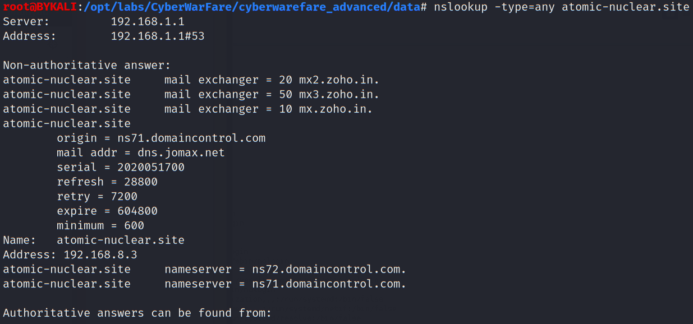
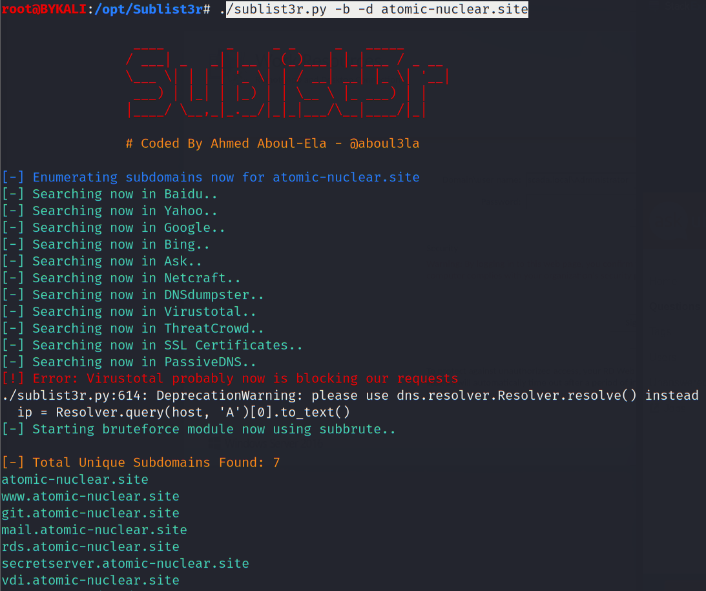
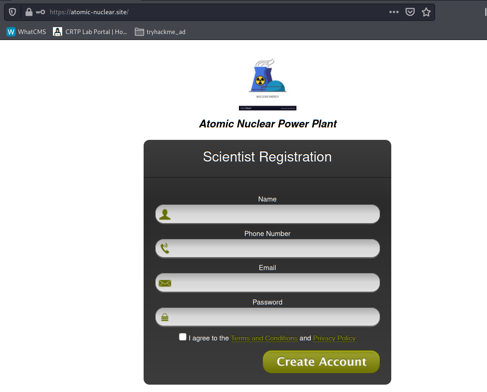
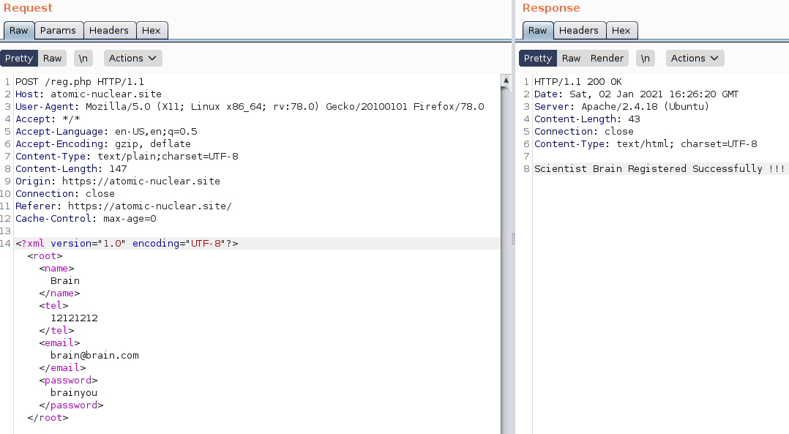

# Recon

- [Recon](#recon)
  - [Domain](#domain)
    - [nslookup](#nslookup)
    - [Sublist3r](#sublist3r)
  - [Service Enumerations](#service-enumerations)
    - [Web](#web)
      - [SSL Certificate](#ssl-certificate)
      - [Website](#website)
        - [/reg.php](#regphp)

## Domain

### nslookup
First do a NSLOOKUP on the domain `atomic-nuclear.site`:

```
nslookup -type=any atomic-nuclear.site
```

  

<br/>

> IP Address:
192.168.8.3
<br/>

### Sublist3r

Use `Sublist3r` to enumerate & brute force the subdomains:

```
./sublist3r.py -b -d atomic-nuclear.site
```

  

```
atomic-nuclear.site
www.atomic-nuclear.site
git.atomic-nuclear.site
mail.atomic-nuclear.site
rds.atomic-nuclear.site
secretserver.atomic-nuclear.site
vdi.atomic-nuclear.site
```

---

## Service Enumerations
Use `nmap` to enumerate the service:
```
nmap -sV -sC -T4 -n -oN nmap-tcp-all.txt -p- --min-rate=1000 192.168.8.3
```


> Services:
> 
> - Web:
>   - tcp/80, tcp/443
>   - Apache/2.4.18
>   - Ubuntu
> 
> - Mail:
>   - tcp/25, tcp/110, tcp/143
>   - Dovecot
> 
> - SSH:
>   - tcp/22
> 
> - RDP:
>   - tcp/3389 (Filtered)

<br/>

### Web
#### SSL Certificate
Subject Alternative Name:

* atomic.site
* nuclear.site
* scada.local

Email:

* iyer@atomic-nuclear.site
* admin@atomic-nuclear.site

<br/>

#### Website

##### /reg.php

  


Enter some information and use Burp to intercept the request:

  


The form is in XML format - could be tested against XXE injection.